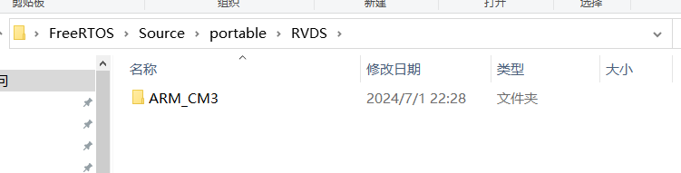
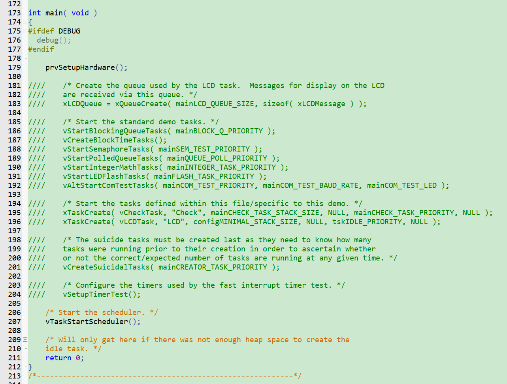
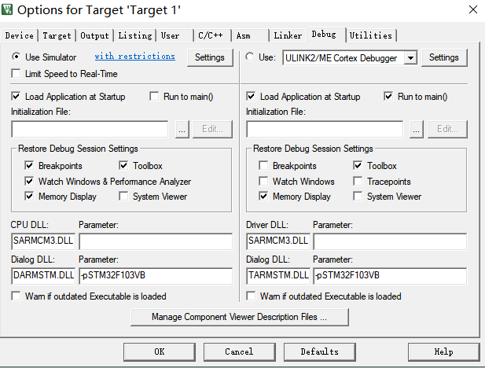
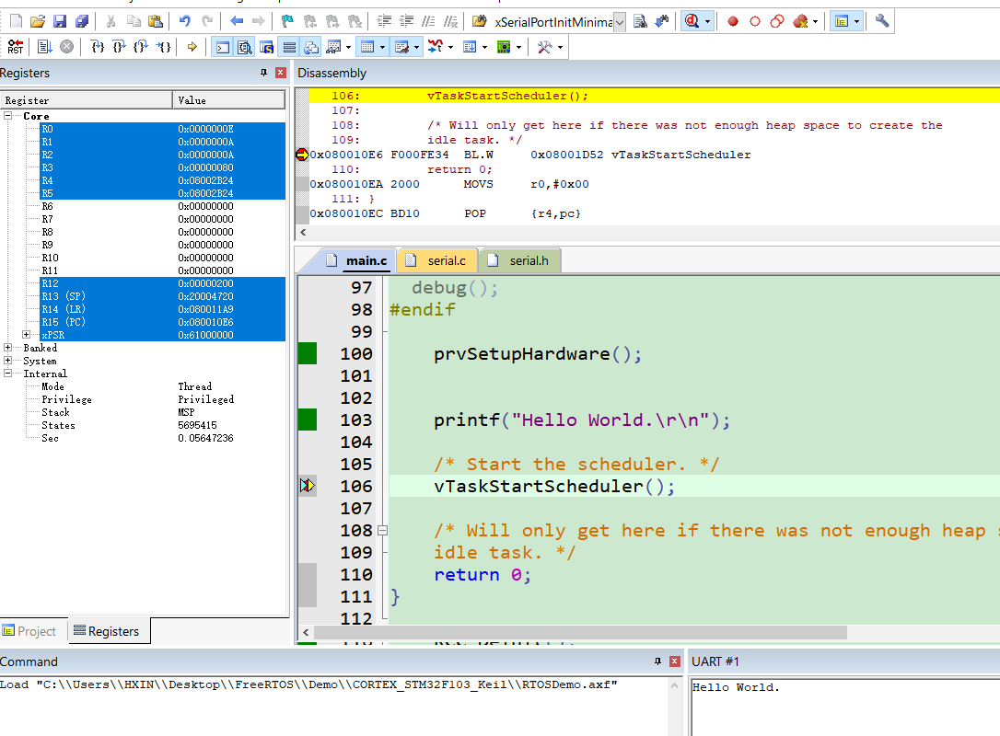

> 详见官方手册
> 只记录遗漏或未知内容

# 一. 堆栈复习
> 临时变量：存在栈内

# 二. 裁剪官方例程
1. 去除无效文件
	
2. 去除无效代码
	
3. 配置串口和输出
```C
int fputc( int ch, FILE *f )
{
	while (USART_GetFlagStatus(USART1, USART_FLAG_TXE) == RESET);
	USART_SendData(USART1, ch);
	
	return ch;
}
```
4. 配置模拟器
	
5. 打印输出
	

# 三. 源码结构和规范
## 3.1 数据类型
1. `TickType_t`：系统心跳时钟计数类型
2. `BaseType_t`：当前架构最高效的数据类型，8位为 `uint8_t`，32位为 `uint32_t`
## 3.2 变量名

| 前缀  | 含义                                                   |
| --- | ---------------------------------------------------- |
| c   | `char`                                               |
| s   | `int16_t, short`                                     |
| i   | `int32_t, long`                                      |
| x   | `BaseType_t`, 其它非标准类型：结构体、task handle、queue handle 等 |
| u   | `unsigned`                                           |
| p   | 指针                                                   |
| uc  | `uint8_t, unsigned char`                             |
| pc  | `char`指针                                             |
## 3.3 函数名

| 前缀                  | 含义                                    |
| ------------------- | ------------------------------------- |
| `vTaskPrioritySet`  | `return: void`（在task.c中定义）            |
| `xQueueReceive`     | `return: BaseType_t`（在queue.c中定义）     |
| `pvTimerGetTimerID` | `return: pointer to void`（在tmer.c中定义） |
## 3.4 宏名
专用：

| 前缀                                   | 含义（定义的文件）                  |
| ------------------------------------ | -------------------------- |
| `port (e.g. portMAX_DELAY)`          | `portable.h / portmacro.h` |
| `task (e.g. taskENTER_CRITICAL())`   | `task.h`                   |
| `pd (e.g. pdTRUE)`                   | `projdefs.h`               |
| `config (e.g. configUSE_PREEMPTION)` | `FreeRTOSConfig.h`         |
| `err (e.g. errQUEUE_FULL)`           | `projdefs.h`               |
通用：

| `pdTRUE`  | `1` |
| --------- | --- |
| `pdFALSE` | `0` |
| `pdPASS`  | `1` |
| `pdFAIL`  | `0` |

# 四. 内存管理


