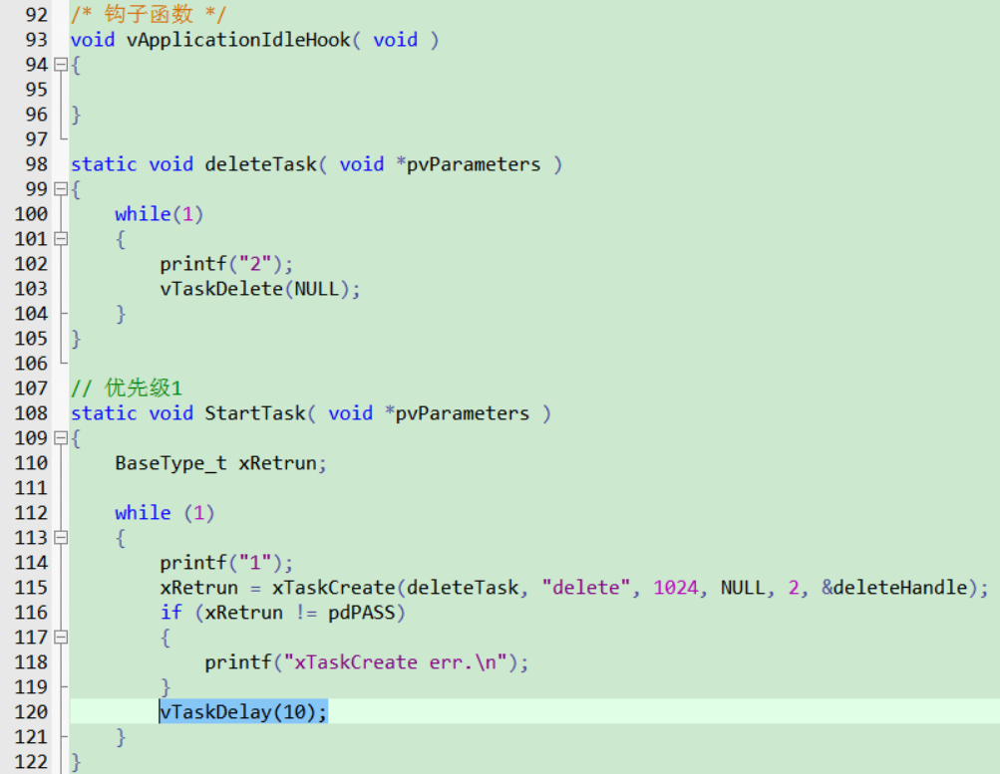
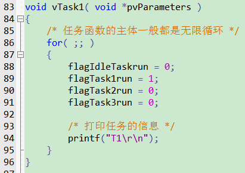
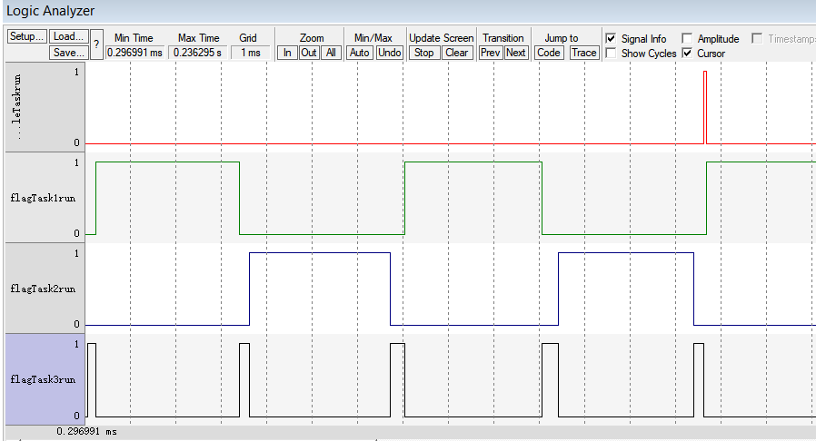

> 详见官方手册
> 只记录遗漏或未知内容

# 一. 堆栈复习
> 临时变量：存在栈内

# 二. 裁剪官方例程
1. 去除无效文件
	
2. 去除无效代码
	
3. 配置串口和输出
```C
int fputc( int ch, FILE *f )
{
	while (USART_GetFlagStatus(USART1, USART_FLAG_TXE) == RESET);
	USART_SendData(USART1, ch);
	
	return ch;
}
```
4. 配置模拟器
	==注意 DLL 和 Parameter 和选择的芯片一致==
	
5. 打印输出
	

# 三. 源码结构和规范
## 3.1 数据类型
1. `TickType_t`：系统心跳时钟计数类型
2. `BaseType_t`：当前架构最高效的数据类型，8位为 `uint8_t`，32位为 `uint32_t`
## 3.2 变量名

| 前缀  | 含义                                                   |
| --- | ---------------------------------------------------- |
| c   | `char`                                               |
| s   | `int16_t, short`                                     |
| i   | `int32_t, long`                                      |
| x   | `BaseType_t`, 其它非标准类型：结构体、task handle、queue handle 等 |
| u   | `unsigned`                                           |
| p   | 指针                                                   |
| uc  | `uint8_t, unsigned char`                             |
| pc  | `char`指针                                             |
## 3.3 函数名

| 前缀                  | 含义                                    |
| ------------------- | ------------------------------------- |
| `vTaskPrioritySet`  | `return: void`（在task.c中定义）            |
| `xQueueReceive`     | `return: BaseType_t`（在queue.c中定义）     |
| `pvTimerGetTimerID` | `return: pointer to void`（在tmer.c中定义） |
## 3.4 宏名
专用：

| 前缀                                   | 含义（定义的文件）                  |
| ------------------------------------ | -------------------------- |
| `port (e.g. portMAX_DELAY)`          | `portable.h / portmacro.h` |
| `task (e.g. taskENTER_CRITICAL())`   | `task.h`                   |
| `pd (e.g. pdTRUE)`                   | `projdefs.h`               |
| `config (e.g. configUSE_PREEMPTION)` | `FreeRTOSConfig.h`         |
| `err (e.g. errQUEUE_FULL)`           | `projdefs.h`               |
通用：

| `pdTRUE`  | `1` |
| --------- | --- |
| `pdFALSE` | `0` |
| `pdPASS`  | `1` |
| `pdFAIL`  | `0` |

# 四. 任务管理
## 4.1 任务创建
### 4.1.1 动态任务
- 多个任务可调用同一个任务函数，每个任务栈独立，运行互不影响
```C
static void StartTask( void *pvParameters )
{
	while (1)
	{
		printf("Start Task.\r\n");
		vTaskDelay(500);
	}
}
xTaskCreate(StartTask, "Start", 100, NULL, 1, &startHandle);
```

### 4.1.2 静态任务
工程路径：`01_project\00_task_static`

- 打开 `configSUPPORT_STATIC_ALLOCATION`
- 需实现空闲任务内存分配函数 `vApplicationGetIdleTaskMemory`
- 多个任务可调用同一个任务函数，每个任务栈独立，运行互不影响
```C
// 打开静态内存
#define configSUPPORT_STATIC_ALLOCATION    1

// 空闲任务
static StaticTask_t idleHandle;
static StackType_t IdleStack[configMINIMAL_STACK_SIZE];
void vApplicationGetIdleTaskMemory(StaticTask_t **ppxIdleTaskTCBBuffer, StackType_t **ppxIdleTaskStackBuffer, uint32_t *pulIdleTaskStackSize)
{
    *ppxIdleTaskTCBBuffer = &idleHandle;
    *ppxIdleTaskStackBuffer = IdleStack;
    *pulIdleTaskStackSize = configMINIMAL_STACK_SIZE;
}

// 任务创建
#define STATS_TASK_SIZE		( 100 )
static StaticTask_t staticHandle;
static StackType_t staticStack[STATS_TASK_SIZE];
static void StaticTask(void *pvParameters)
{
	while (1)
	{
		printf("Static Task.\r\n");
		vTaskDelay(500);
	}
}
xTaskCreateStatic(StaticTask, "Static", STATS_TASK_SIZE, NULL, 1, staticStack, &staticHandle);
```

## 4.2 任务删除
```C
vTaskDelete(NULL);  		// 删除自身
vTaskDelete(&otherHandle);  // 删除其它任务
```

## 4.3 任务优先级和系统中断
### 4.3.1 任务优先级
> 优先级范围：`0~(configMAX_PRIORITIES – 1)`，*==越大优先级越高==*

默认调度机制：
1. 高优先级任务先运行，同等任务轮流运行
2. 若高优先级任务不主动放弃运行，低优先级任务无法运行

### 4.3.2 系统中断
- FreeRTOS在系统滴答中断内切换任务
- 同优先级任务的时间片 = 滴答定时器的周期时间（如：滴答1ms，各任务轮流运行1ms）
- FreeRTOS 内用 `pdMS_TO_TICKS` 将 ms 转换为 tick，如：`vTaskDelay(pdMS_TO_TICKS(50))`延时 50ms 对应的 tick


## 4.4 任务状态
1. 就绪状态(Ready)：**任务刚创建时**、任务运行时被高优先级打断、结束阻塞/暂停时
2. 运行状态(Running)：任务正在运行
3. 阻塞状态(Blocked)：等待某事发生，如：等待队列、系统延时
4. 暂停状态(Suspended)：主动休息，唯一方法：`vTaskSuspend`；退出暂停，只能由其它任务：`vTaskResume`


```C
vTaskSuspend(NULL);  		 // 暂停自身
vTaskSuspend(&otherHandle);  // 暂停其它任务
vTaskResume(&otherHandle);   // 恢复其它任务
```

## 4.5 延时函数
```C
vTaskDelay(n);				// 绝对时间
vTaskDelayUntil(&pre, n);	// 相对时间，到时间后会更新 pre = pre + n
```


## 4.6 空闲任务及其钩子函数
### 4.6.1 空闲任务
1. 特点：
	1. 优先级为0
	2. 只能处于就绪态和运行态，永不堵塞
2. 作用：
	1. 释放被删除的任务的内存（==删除自身的情况==），若用户任务永不堵塞，空闲任务将无法运行，也无法释放内存
		
	2. 调度器必须有一个可运行的函数

例：关闭空闲任务
工程路径：`01_project\01_idle_none`


### 4.6.2 钩子函数
使能：

 注意：
> 1. 执行一些低优先级的、后台的、需要连续执行的函数
> 2. 测量系统的空闲时间：计算处理器占用率
> 3. 让系统进入省电模式

例：使能空闲任务
工程路径：`01_project\02_idle_hook`
1. 用户任务不堵塞：空闲任务无法运行
	
	
2. 用户任务堵塞：空闲任务可运行释放内存
	
	

## 4.7 调度算法
### 4.7.1 相关概念
正在运行的任务：
1. 被称为"正在使用处理器"，它处于运行状态。
2. 在单处理系统中，任何时间里只能有一个任务处于运行状态。

非运行状态的任务：
1. 阻塞(Blocked)：在等待"事件"，当事件发生时任务就会进入就绪状态。
2. 暂停(Suspended)
3. 就绪(Ready)：可以被调度器切换为运行状态，最高优先级的就绪态任务先进入运行状态。

事件分为两类：
1. 时间相关的事件：设置超时时间，在指定时间内阻塞，时间到了就进入就绪状态。使用时间相关的事件，可以实现周期性、超时功能。
2. 同步事件：某个任务在等待某些信息，别的任务或者中断服务程序会给它发送信息。有：任务通知(task notification)、队列(queue)、事件组(event group)、信号量(semaphoe)、互斥量(mutex)等。这些方法用来发送同步信息，比如表示某个外设得到了数据。

### 4.7.2 配置调度算法
`configUSE_PREEMPTION`：可否抢占
1. 可："可抢占调度"(Pre-emptive)，高优先级的就绪任务立即执行
2. 否："合作调度模式"(Co-operative Scheduling)，必须等待当前任务执行完毕后再运行最高优先级就绪任务

`onfigUSE_TIME_SLICING`：可抢占的前提下，同优先级任务是否轮流执行
1. 是："时间片轮转"(Time Slicing)，同优先级的任务轮流执行
2. 否："非时间片轮转"(without Time Slicing)，当前任务会一直执行，直到主动放弃、或者被高优先级任务抢占

`configIDLE_SHOULD_YIELD`：可抢占+时间片轮转的前提下，空闲任务是否让步于用户任务
1. 是：空闲任务每执行一次循环，就判断是否主动让步给用户任务
2. 否：空闲任务同用户任务，轮流执行

`configUSE_TICKLESS_IDLE`：用于关闭系统中断来实现省电

| 配置项                       |  A  |  B  |  C  |  D  |  E  |
| :------------------------ | :-: | :-: | :-: | :-: | :-: |
| `configUSE_PREEMPTION`    |  1  |  1  |  1  |  1  |  0  |
| `configUSE_TIME_SLICING`  |  1  |  1  |  0  |  0  |  x  |
| `configIDLE_SHOULD_YIELD` |  1  |  0  |  1  |  0  |  x  |
注：
- A：可抢占+时间片轮转+空闲任务让步
- B：可抢占+时间片轮转+空闲任务不让步
- C：可抢占+非时间片轮转+空闲任务让步
- D：可抢占+非时间片轮转+空闲任务不让步
- E：合作调度

工程路径：`01_project\03_scheduler`




> 任务3立即执行，任务1和2轮换，空闲任务让步给用户任务


> 任务3执行完后，任务1一直执行



> 任务1一直执行，不与任务2轮换，直到被任务3打断


> 空闲任务和用户任务轮换，不让步

# 五. 内部机制
