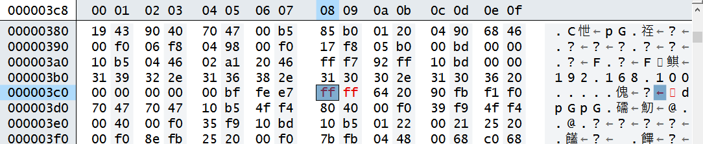

反汇编：`fromelf --text -a -c --output=all.dis F103_Moduel\F103_Moduel.axf`

bin文件：`fromelf --bin --output=test.bin F103_Moduel\F103_Moduel.axf`


# 一. 栈回溯

代码路径：`01_project\01_FreeRTOS_stacktrace`

## 1.1 函数调用关系

  

 

 

## 1.2 函数栈

 

## 1.3 异常复习

> 1. 硬件保存现场
> 2. LR = EXC_RETURN，跳转异常函数
> 3. 处理异常函数
> 4. 跳转返回地址 LR
> 5. 若 LR = EXC_RETURN，硬件恢复现场

 


## 1.4 异常处理

> 1. 先确定是 msp(主栈) 还是 psp(线程栈)
> 2. 将 `r4~r11`、`lr`入栈 (硬件保存的是异常中断函数的返回地址，而这个为 `EXC_RETURN`)
> 3. 将栈指针传入处理函数并跳转

```php
// 跳转异常处理函数前:
// 1.硬件已入栈 r0~r3,r12,lr,pc(返回地址),xPSR
// 2.lr = EXC_RETURN
// RTOS下, CPU 使用 psp 入栈; 进入异常函数后切换为 msp; 退出异常时恢复 psp
IMPORT rt_hw_hard_fault_exception
EXPORT HardFault_Handler
HardFault_Handler    PROC

// 判断 EXC_RETURN, 决定使用 msp(主堆栈指针) 还是 psp(进程堆栈指针) 寄存器
// get current context
TST     lr, #0x04  // if(!EXC_RETURN[2])
ITE     EQ
MRSEQ   r0, msp  // [2]=0 ==> Z=1, get fault context from handler.
MRSNE   r0, psp  // [2]=1 ==> Z=0, get fault context from thread.
	
// 软件入栈 r4~r11,lr
// 入栈后 r0 更新位置(需更新栈指针)
STMFD   r0!, {r4 - r11}    // push r4 - r11 register
STMFD   r0!, {lr}          // push exec_return register
	
// 更新 msp / psp
TST     lr, #0x04  // if(!EXC_RETURN[2])
ITE     EQ
MSREQ   msp, r0  // [2]=0 ==> Z=1, update stack pointer to MSP.
MSRNE   psp, r0  // [2]=1 ==> Z=0, update stack pointer to PSP.
	
// 调用 rt_hw_hard_fault_exception, r0 为第1个形参
PUSH    {lr}  // 此时入栈不影响 r0 传入的 sp 位置
BL      rt_hw_hard_fault_exception
POP     {lr}

ORR     lr, lr, #0x04
BX      lr
ENDP
```

```c
#define rt_uint32_t unsigned int
struct exception_info
{
    rt_uint32_t exc_return;
    rt_uint32_t r4;
    rt_uint32_t r5;
    rt_uint32_t r6;
    rt_uint32_t r7;
    rt_uint32_t r8;
    rt_uint32_t r9;
    rt_uint32_t r10;
    rt_uint32_t r11;
    rt_uint32_t r0;
    rt_uint32_t r1;
    rt_uint32_t r2;
    rt_uint32_t r3;
    rt_uint32_t r12;
    rt_uint32_t lr;
    rt_uint32_t pc;
    rt_uint32_t psr;
};

void rt_hw_hard_fault_exception(struct exception_info * exception_info)
{
	unsigned int *app_sp;
	
	int i;
	
	/* exception_info + 1, 指向硬件入栈前的位置(注意指针类型) */
	app_sp = (unsigned int *)(exception_info + 1);  /* context + 16*4 */
	
	printf("psr: 0x%08x\r\n", exception_info->psr);
	printf("r00: 0x%08x\r\n", exception_info->r0);
	printf("r01: 0x%08x\r\n", exception_info->r1);
	printf("r02: 0x%08x\r\n", exception_info->r2);
	printf("r03: 0x%08x\r\n", exception_info->r3);
	printf("r04: 0x%08x\r\n", exception_info->r4);
	printf("r05: 0x%08x\r\n", exception_info->r5);
	printf("r06: 0x%08x\r\n", exception_info->r6);
	printf("r07: 0x%08x\r\n", exception_info->r7);
	printf("r08: 0x%08x\r\n", exception_info->r8);
	printf("r09: 0x%08x\r\n", exception_info->r9);
	printf("r10: 0x%08x\r\n", exception_info->r10);
	printf("r11: 0x%08x\r\n", exception_info->r11);
	printf("r12: 0x%08x\r\n", exception_info->r12);
	printf(" lr: 0x%08x\r\n", exception_info->lr);
	printf(" pc: 0x%08x\r\n", exception_info->pc);
	
	printf("stacks: \r\n");
	i = 0;
	for (i = 0; i < 1024; )
	{
		printf("%08x ", *app_sp);
		app_sp++;
		i++;
		if (i % 16 == 0)
			printf("\r\n");
			
	}
	printf("\r\n");

	while (1);
}
```

```c
static void A(void)
{
	printf("Enter A()\r\n");
	B();
	printf("Exit A()\r\n");
}
static void B(void)
{
	printf("Enter B()\r\n");
	C(0);  // 100 / 0 -> 异常
	printf("Exit B()\r\n");
}
static int C(int b)
{
	return 100/b;
}
static void D(void)
{	
	printf("Enter D()\r\n");
	C(1);
	printf("Exit D()\r\n");
}
void TestDebug(void)
{
	/* 100ask add */
	/* 使能除0错误
	 * CCR(0xE000ED14)的bit4(DIV_0_TRP)设置为1
	 */
	volatile int *CCR = (volatile int *)0xE000ED14;
	*CCR |= (1<<4);
	
	A();
	D();
}
```

 


 

结果：


## 1.5 手动分析

> 二进制文件中的程序地址会将 `0x08000000` 映射为 `0`
1. 进异常前 `pc = 0x080003ac`，定位为异常代码在函数 C 内
   异常代码：`r0 = r0 / r1, r0 = 0x00000064 = 100, r1 = 0x00000000`
   

2. 进异常前 `lr = 0x08000383`，清bit0，为 `0x08000382`，即函数 C 被函数 B 调用
    

3. 函数 B 栈内只有 r4 和 lr，即 `lr = 0x08000355`，清bit0，为 `0x08000354`
    
   即函数 B 被函数 A 调用
   
4. 函数 A 栈内只有 r4 和 lr，即 lr = `0x08001c45`，清bit0，为 `0x08001c44`
    
   即函数 A 被函数 TestDebug 调用
    
> 以上为手动定位异常代码的函数调用关系流程

# 二. 修改bin文件实现断点

## 2.1 只打一个断点

> 1. ==将想要打断点的指令修改为异常指令==
> 2. 使能未定义指令异常
> 3. 异常中断函数同上一章栈回溯

代码路径：`01_project\02_FreeRTOS_breakpoint`

```php
UsageFault_Handler PROC
//; get current context
TST 	lr, #0x04			// if(!EXC_RETURN[2])
ITE 	EQ
MRSEQ	r0, msp // [2]=0 ==> Z=1, get fault context from handler.
MRSNE	r0, psp // [2]=1 ==> Z=0, get fault context from thread.
		
STMFD	r0!, {r4 - r11} 	// push r4 - r11 register
STMFD	r0!, {lr}			// push exec_return register
		
TST 	lr, #0x04			// if(!EXC_RETURN[2])
ITE 	EQ
MSREQ	msp, r0 // [2]=0 ==> Z=1, update stack pointer to MSP.
MSRNE	psp, r0 // [2]=1 ==> Z=0, update stack pointer to PSP.
		
PUSH	{lr}
BL		rt_hw_hard_fault_exception
POP 	{lr}
		
ORR 	lr, lr, #0x04
BX		lr
ENDP
```

```c
static void A(void)
{
	volatile int val = 1;
	//volatile int val2 = 1;
	char buf[16];
	B(buf);
	C(val);
}

static void B(char *buf)
{
	strcpy(buf, "192.168.100.106 ");
}

static int C(int b)
{
	return 100/b;
}

static void D(void)
{
	printf("Enter D()\r\n");
	C(1);
	printf("Exit D()\r\n");
}
```

此时在C函数入口手动打断点：将 0x080003c8 指令修改为 0xFFFF

==注意：bin文件内，0x08000000 重映射为 0，即 0x080003c8 为 0x3c8==

 

 



结果：==PC = 0x080003c8，与 bin 文件内打的断点位置一致==

 

解析：

 

```php
static void A(void)
{
	volatile int val = 1;
	//volatile int val2 = 1;
	char buf[16];
	B(buf);
	C(val);
}

A
0x08000386:    b500        ..      PUSH     {lr}
// sp = sp-0x14 (buf 16 字节 + val 4 字节)
0x08000388:    b085        ..      SUB      sp,sp,#0x14
// r0 = 1 (val = 1)
0x0800038a:    2001        .       MOVS     r0,#1
// 将 r0 写入 sp+0x10 处 (val 存在 sp+0x10)
0x0800038c:    9004        ..      STR      r0,[sp,#0x10]
// r0 = sp (buf), 传入 B 函数
0x0800038e:    4668        hF      MOV      r0,sp
0x08000390:    f000f806    ....    BL       B ; 0x80003a0
// 调用完函数 B 后, 将 sp+0x10 传入函数 C
0x08000394:    9804        ..      LDR      r0,[sp,#0x10]
0x08000396:    f000f817    ....    BL       C ; 0x80003c8
0x0800039a:    b005        ..      ADD      sp,sp,#0x14
0x0800039c:    bd00        ..      POP      {pc}
0x0800039e:    0000        ..      MOVS     r0,r0
```

```php
static void B(char *buf)
{
	strcpy(buf, "192.168.100.106 ");
}

B
0x080003a0:    b510        ..      PUSH     {r4,lr}
0x080003a2:    4604        .F      MOV      r4,r0
0x080003a4:    a102        ..      ADR      r1,{pc}+0xc ; 0x80003b0
0x080003a6:    4620         F      MOV      r0,r4
// 将 buf 传入 strcpy, 此处复制了 16 个字符 + '\0'
0x080003a8:    f7ffff92    ....    BL       strcpy ; 0x80002d0
0x080003ac:    bd10        ..      POP      {r4,pc}
```

>- `R0 = 0x00000000`，即 C 函数的参数 b 为 0，即 A 函数内的 val 变量被异常清 0
>
>- B函数 strcpy 末尾补 '\0'，导致清零了 `buf[16]`，误将 val 清0，传入给c函数的b为0，触发异常

