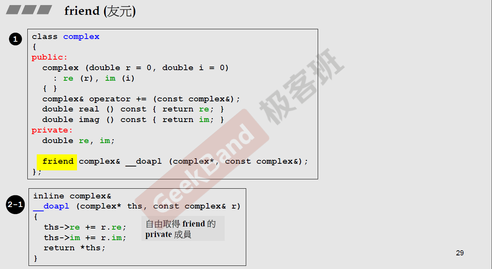
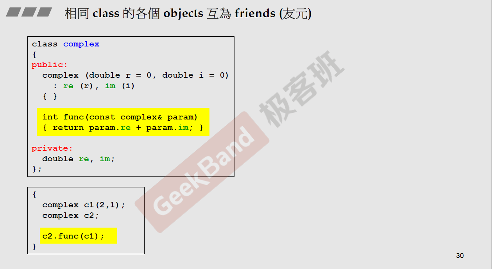

# C++面向对象高级编程

## 上


### 1. C++编程简介


### 2. 头文件与类的声明

#### 2.1 头文件布局：


#### 2.2 类的声明


> 类是创建对象的模版，类似于C语言的结构体；
>
> 类创建的变量称对象，创建对象的过程叫类的实例化；
>
> 类里面的变量称成员变量，函数称成员函数；


### 3. 构造函数

#### 3.1 内联函数


> 即使加上 inline，但实际是否有效看编译器的处理

#### 3.2 访问等级


> 一般类的成员函数为 public，成员变量为 private

#### 3.3 构造函数

1. 构造函数示例：

   

2. **不可重复：构造函数1有默认值，可不传参数；2也不传参数，即1和2不可共存**

   

3. 单件模式（构造函数在 private 内，外界只可存在一个A，且只可通过函数调用）

   


### 4. 参数传递与返回值

#### 4.1 函数 const

若函数不改变类的成员变量，必须加上 const，否则以 `const complex c1(2, 1)`形式创建对象后，再调用不带 const 的成员函数后，编译器会报错，即认为调用的成员函数可以修改成员变量。


#### 4.2 参数

1. pass by value - 数值

2. pass by reference (to const) - 引用（C语言指针）

   

> 尽量传引用，引用参数的使用、加不加 const，同C语言指针

#### 4.3 返回值

如果返回的不是局部变量，那么尽量返回引用


> 1. 返回引用：参数提供给返回
>
> 2. 返回数值：参数不提供返回，需要函数创建局部变量返回

> 引用和指针的区别：引用相当于原对象/变量的另一个名称，修改引用会同步修改原对象/变量，即使传入到函数内；指针同C语言

#### 4.4 友元

##### 4.4.1 简介



> 可获取 friend 的 private 成员变量

##### 4.4.2互为友元



> 相同 class 的各个 objects 互为 friends


### 5. 操作符重载与临时对象

#### 5.1 成员函数

```c++
返回 complex::operator += / -= / *=
```


> 1. <font color='red'> C++里操作符为函数 </font>
> 3. this 为指针，指向调用者（例中 C2 的地址）

#### 5.2 引用的优点


> 1. 传递者无需知道接收形式，数值和传入写法一样（包括传入和返回）
>
> 2. 返回解引用 `*ths` 可以和 `complex&` 搭配
>
> 3. 操作符函数必须返回 `complex&`（优先引用）：
>    1. 若只执行`C2 += C1`形式，可返回 `void`
>    2. <font color='red'> 若需执行`C3 += C2 += C1`，`C2 += C1`的结果需作为右值继续传入操作符函数 </font>

#### 5.3 非成员函数

```c++
返回 operator + / - / *
```


##### 5.3.1 获取成员变量


##### 5.3.2 +法


##### 5.3.2 临时对象

- 类 ()：创建临时对象


> <font color='red'> 不可返回引用，因为左加右，非右加到左，产生了一个新的结果，返回的是个局部变量 </font>

##### 5.3.3 正负号


> 编译器根据参数区分加减还是正负
>
> <font color='red'> 正号返回数值：可返回引用（标准库并非最优解） </font>
>
> <font color='red'>负号返回数值：同 5.3.2 </font>

##### 5.3.4 ==


##### 5.3.5 输出


> `cout << conj(c1);` << 只会作用在 cout 上，cout 并不会处理新创建的类
>
> <font color='red'> << 必须为非成员函数：第一个参数 cout 为 ostream 类型，且不可为 const，因为在传输过程中 cout 的状态一直在变 </font>
>
> <font color='red'> 返回必须为 ostream&（优先引用）且不能为 const：cout << c1 << conj(c1); 先执行 cout << c1 输出 c1，得到的结果还要能继续输出 conj(c1) </font>


### 6. 复习Complex类的实现过程

#### 6.1 总结

1. 构造函数：一定要有初始列
2. 成员函数不修改成员变量的情况下一定要 const：`double real () const { return re; }`
3. 参数传递：尽量使用 引用，且考虑 const
4. 返回值：考虑 引用 和 const
5. public：成员函数尽量公开
6. private：成员变量尽量私有

#### 6.2 代码

```c++
//
// Created by HXIN on 2024/5/4.
//

#ifndef INC_00_COMPLEX_COMPLEX_TEST_H
#define INC_00_COMPLEX_COMPLEX_TEST_H


// 声明
class complex_test;
complex_test&
__doapl (complex_test* ths, const complex_test& r);

class complex_test
{
public:
    complex_test (double r = 0, double i = 0) : re (r), im (i) { }
    complex_test& operator += (const complex_test&);
    double real () const { return re; }
    double imag () const { return im; }

private:
    double re, im;
    friend complex_test& __doapl (complex_test *, const complex_test&);
};

/* 类成员函数 */
// +=
inline complex_test&  // 解引用 *ths 可以和引用搭配
__doapl (complex_test* ths, const complex_test& r)
{
    ths->re += r.re;
    ths->im += r.im;
    return *ths;
}
inline complex_test&  // 必须返回引用：存在 C1 += C2 += C3
complex_test::operator += (const complex_test& r)
{
    return __doapl(this, r);
}

/* 类以外的定义 */
// 获取成员变量
inline double
imag (const complex_test& x)
{
    return x.imag ();
}
inline double
real (const complex_test& x)
{
    return x.real ();
}
// 加
inline complex_test  // 局部变量只能返回数据
operator + (const complex_test& x, const complex_test& y)
{
    return complex_test (real (x) + real (y), imag (x) + imag (y));
}
inline complex_test
operator + (const complex_test& x, double y)
{
    return complex_test (real (x) + y, imag (x));
}
inline complex_test
operator + (double x, const complex_test& y)
{
    return complex_test (x + real (y), imag (y));
}
// 减
inline complex_test
operator - (const complex_test& x, const complex_test& y)
{
    return complex_test (real (x) - real (y), imag (x) - imag (y));
}
inline complex_test
operator - (const complex_test& x, double y)
{
    return complex_test (real (x) - y, imag (x));
}
inline complex_test
operator - (double x, const complex_test& y)
{
    return complex_test (x - real (y), - imag (y));
}
// 乘
inline complex_test
operator * (const complex_test& x, const complex_test& y)
{
    return complex_test (real (x) * real (y) - imag (x) * imag (y),
                    real (x) * imag (y) + imag (x) * real (y));
}
inline complex_test
operator * (const complex_test& x, double y)
{
    return complex_test (real (x) * y, imag (x) * y);
}
inline complex_test
operator * (double x, const complex_test& y)
{
    return complex_test (x * real (y), x * imag (y));
}
// 除
complex_test
operator / (const complex_test& x, double y)
{
    return complex_test (real (x) / y, imag (x) / y);
}
// 正负号
inline complex_test
operator + (const complex_test& x)
{
    return x;
}
inline complex_test
operator - (const complex_test& x)
{
    return complex_test (-real (x), -imag (x));
}
// ==
inline bool
operator == (const complex_test& x, const complex_test& y)
{
    return real (x) == real (y) && imag (x) == imag (y);
}
inline bool
operator == (const complex_test& x, double y)
{
    return real (x) == y && imag (x) == 0;
}
inline bool
operator == (double x, const complex_test& y)
{
    return x == real (y) && imag (y) == 0;
}
// !=
inline bool
operator != (const complex_test& x, const complex_test& y)
{
    return real (x) != real (y) || imag (x) != imag (y);
}
inline bool
operator != (const complex_test& x, double y)
{
    return real (x) != y || imag (x) != 0;
}
inline bool
operator != (double x, const complex_test& y)
{
    return x != real (y) || imag (y) != 0;
}

#include <cmath>

inline complex_test
polar (double r, double t)
{
    return complex_test (r * cos (t), r * sin (t));
}
inline complex_test
conj (const complex_test& x)
{
    return complex_test (real (x), -imag (x));
}
inline double
norm (const complex_test& x)
{
    return real (x) * real (x) + imag (x) * imag (x);
}


#endif //INC_00_COMPLEX_COMPLEX_TEST_H


#include <iostream>
#include "complex_test.h"

using namespace std;

ostream&
operator << (ostream& os, const complex_test& x)
{
    return os << '(' << real (x) << ',' << imag (x) << ')';
}

int main()
{
    complex_test c1(2, 1);
    complex_test c2(4, 0);

    cout << c1 << endl;
    cout << c2 << endl;

    cout << c1 + c2 << endl;
    cout << c1 - c2 << endl;
    cout << c1 * c2 << endl;
    cout << c1 / 2 << endl;

    cout << conj(c1) << endl;
    cout << norm(c1) << endl;
    cout << polar(10,4) << endl;

    cout << (c1 += c2) << endl;

    cout << (c1 == c2) << endl;
    cout << (c1 != c2) << endl;
    cout << +c2 << endl;
    cout << -c2 << endl;

    cout << (c2 - 2) << endl;
    cout << (5 + c2) << endl;

    return 0;
}

```


### 7. 三大函数：拷贝构造，拷贝复制，析构


### 8. 堆，栈与内存管理


### 9.复习String类的实现过程


### 10. 扩展补充：类模版，函数模版，及其它


### 11. 组合与继承


### 12. 虚函数与多态


### 13. 委托相关设计


## 下


