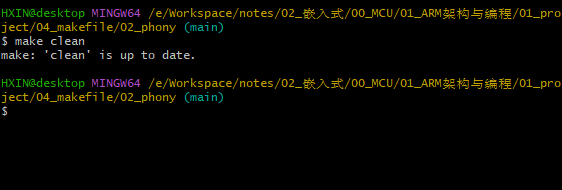
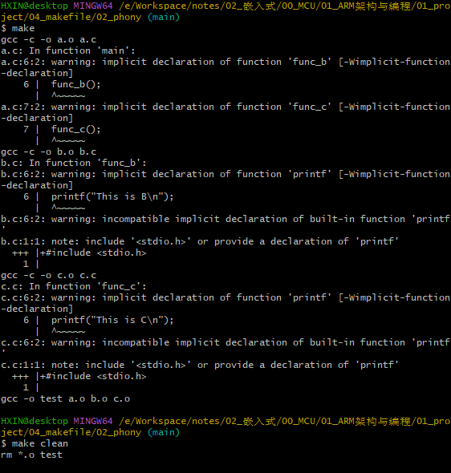

# 一. 嵌入式概念及硬件组成

## 1.1 处理器的区分

* MPU（微处理器单元）：作用等同于CPU，需配合内存、Flash等外设才能使用
* MCU（微控制器单元/单片机）：内部集成处理器和各类模块，CPU+RAM+Flash...
* Application Processors（应用处理器）：MCU的升级版本，如：手机主芯片

## 1.2 嵌入式系统硬件组成

* 片内ROM（read only memory）：只读，用于执行CPU启动程序
* 片内RAM（random access memory）：可读可写，用于处理变量
*   


---

# 二. 启动程序

程序运行栈（程序目录：01_project\01_led_c）：

``````assembly
PRESERVE8
THUMB
AREA    RESET, DATA, READONLY
; 前三行为语法规定

EXPORT  __Vectors
__Vectors       DCD     0
DCD     Reset_Handler              ; Reset Handler

AREA    |.text|, CODE, READONLY

; Reset handler
Reset_Handler   PROC
EXPORT  Reset_Handler             [WEAK]
IMPORT  main					; 调用外部函数 main

LDR SP, =(0x20000000+0x10000)  	; 设置栈
BL main							; 跳转到 main

ENDP

END		 
``````

 


---

# 三. ARM 架构

## 3.1 地址空间

1. **X86架构地址：内存和IO分开**
   *   

2. **ARM架构地址：内存和IO一样**
   *   

3. **RISC指令（精简指令）**
   *  

4. **CISC指令（复杂指令）**
   *  

## 3.2 ARM 内部寄存器

 

> PC：指向下一条指令地址
>
> LR：BL/BLX 指令会自动将 PC 存入 LR，然后跳转到目标地址
>
> 异常/中断：当产生异常/中断时，处理器会自动将 PC 存入 LR 中
>
> - Cortex A7：==PC = CUR ADDR + 8==；ARM 指令
> - Cortex M3/M4：==PC = CUR ADDR + 4==，Thumb 指令（不管 16 位还是 32 位）
> - 处理器指令处理：==执行当前指令，处理下一条，读取下下条==

1. **不同芯片内部寄存器**

   * SP_process：RTOS线程栈指针

   * SP_main：主程序栈指针
   
   
      * xPSR：程序状态寄存器
   
   
      * CPSR：当前程序状态寄存器
   
   
      *  
   


2. **xPSR（M3/M4）**
   * 重点关注：N、Z、C、V、Q
   *  


3. **CPSR（A7）：**
   * 重点关注：N、Z、C、V、Q
   *  


4. **A7内部寄存器：**
   * 不同模式寄存器不一样
   *  

## 3.3 ARM 汇编

### 3.3.1 指令集

* Thumb 指令集：16位，节省空间

* ARM 指令集：32位，高效，太占空间

* Thumb-2 指令集：16位和32位混合

  > 程序可能部分使用16位指令，部分使用32位指令。

1. **ARM/cortex-A7：使用 Thumb 和 ARM 混合**

   * CODE16：BX A_addr -> CODE32

   * CODE32：BX B_addr+1 -> CODE16

     > 通过函数地址的第 0 位来区分，在 ARM 指令集和 Thumb 指令集之间来回切换

2. **cortex-M3/M4：使用 Thumb-2**

   <blockquote alt = 'red'>Thumb-2 指令集：16 位和 32 位混合，CPU自动区分</blockquote>

### 3.3.2 UAL

* **ARM 统一的汇编语言**

> 参考书籍：
>
> 《DEN0013D_cortex_a_series_PG》P70
>
> 《ARM Cortex-M3与Cortex-M4权威指南》第5章

1. **以“数据处理”指令为例，UAL汇编格式为：**

   ``````C
   Operation{cond}{S} Rd, Rn, Operand2
   ``````

   * Operation：表示各类汇编指令，如：ADD、MOV

   * cond：表示 condtion，即该指令执行的条件

     * ``````assembly
       CMP R1, R3
       MOV EQ R1, R2
       ``````

     * EQ：为 cond，如果 CMP 指令成立，才会执行 MOV 语句

   * S：表示该指令执行后，会区修改程序状态寄存器

   * Rd：表示目的寄存器

   * Rn、Operand2：两个源操作函数

2. **立即数**

   ``````assembly
   MOV R0, #VAL
   ``````

   * VAL 必须是立即数
   * 立即数 = 某个8位数，循环移位某个偶位数

3. **伪指令**

   ``````assembly
   LDR R0, =VAL
   ``````

   * = 表示该指令为伪指令
   * VAL 可以是任意值
   * 编译器会将其转换为真实的指令
     * 若 VAL 为立即数：`MOV R0, #VAL`
     * 若不是立即数：`LDR R0, [PC, #offset]`，从内存中读出该值

   ``````assembly
   ADR R0, Loop
   Loop
   	ADD R0, R0, #1
   ``````

   * `ADR R0, Loop` 转换成 `ADD R0, PC, #val`，val 在链接时确定

## 3.4 ARM 汇编模拟器：VisUAL

> 官网：https://salmanarif.bitbucket.io/visual/downloads.html
>
> 使用方法：[https://salmanarif.bitbucket.io/visual/user_guide/index.html](https://salmanarif.bitbucket.io/visual/user_guide/index.html)

``````assembly
MOV		R0, #0x20000  	; 将 0x20000 写入到 R0
LDR		R1, =0x1234   	; 将 0x1234 写入到 R1
LDR		R2, =0x3456		; 将 0x3456 写入到 R2
CMP		R1, R2			; 比较 R1 和 R2 的值
STRLE	R1, [R0]		; 若 R1<=R2，执行该指令，将 R1 的数据写入 R0 所指向的地址
STRGT	R2, [R0]		; 若 R1>R2，执行该指令，将 R2 的数据写入 R0 所指向的地址
``````

## 3.5 内存访问指令

### 3.5.1 指令详解

1. **LDR：Load Register，读内存，从内存中将一个 32 位的数据写入到目的寄存器中**
   * LDRB：将存储器中的 1 字节数据写入到目的寄存器中，同时将寄存器的高 24 位清零
     
   * LDRH：将存储器中的 2 字节数据写入到目的寄存器中，同时将寄存器的高 16 位清零
   *  


2. **STR：Store Register，写内存，从源寄存器中将一个32位的数据写入到目的内存中**

   * STRB：从源寄存器中将 1 字节数据写入到内存中，该字节数据为源寄存器中的低 8 位

   * STRH：从源寄存器中将 2 字节数据写入到内存中，该半字数据为源寄存器中的低 16 位
   
   *   

3. **LDM：Load Multiple Register，读多个内存**

4. **STM：Store Multiple Register，写多个内存**

    

   * **reglist：低标号的寄存器对应低地址**
   * IA, IB, DA, DB 的区别
     *   
   

   例1：

    ``````assembly
    ldr		r0, =0x20000		 ; 将 0x20000 写入到 r0
    ldr		r1, =0x12345678	 ; 将 0x12345678 写入到 r1
    str		r1, [r0]			  ; 将 r1 的数据写到 r0 所指地址
    ldrb	r3, [r0]			  ; 从 r0 所指地址读数据到 r3
    ``````

    例2：

    ``````assembly
    MOV		R0, #0x20000
    MOV		R1, #0x10
    MOV		R2, #0x12
    STR		R2, [R0]              ; R2 的值存到 R0 所示地址
    STR		R2, [R0, #4]          ; R2 的值存到 R0+4 所示地址
    STR		R2, [R0, #8]!         ; R2 的值存到 R0+8 所示地址, R0=R0+8
    STR		R2, [R0, R1]          ; R2 的值存到 R0+R1 所示地址
    STR		R2, [R0, R1, LSL #4]  ; R2 的值存到 R0+(R1<<4) 所示地址
    STR		R2, [R0], #0X20       ; R2 的值存到 R0 所示地址, R0=R0+0x20
    MOV		R2, #0x34
    STR		R2, [R0]              ; R2 的值存到 R0 所示地址
    LDR		R3, [R0], +R1, LSL #1 ; R3 的值等于 R0+(R1<<1) 所示地址上的值，R0=R0+(R1<<1)
    ``````

    例3：

    ``````assembly
    MOV		R1, #1
    MOV		R2, #2
    MOV		R3, #3
    MOV		R0, #0x20000
    STMIA	R0,	{R1-R3} 	; 入栈：R1,R2,R3 分别存入 R0,R0+4,R0+8 地址处
    ADD		R0, R0, #0x10
    STMIA	R0!, {R1-R3} 	; 出栈：R1,R2,R3 分别存入 R0,R0+4,R0+8 地址处, R0=R0+3*4
    ``````


### 3.5.2 栈的4种方式

1. **满/空**

   * 满 SP：指向最后一个入栈的数据地址，先修改 SP 在入栈
   * 空 SP：指向下一个空地址，先入栈再修改 SP

2. **增/减**

   * 增：SP 变大
   * 减：SP 变小

3. **满增、满减、空增、空减**

   * 满减：SP 指向 0x1004，内有数据，数据入栈时，SP 先指向 0x1000，再写入数据（先减后写）

   * 满增：SP 指向 0x1000，内有数据，数据出栈时，先读取数据，SP 再指向 0x1004（先读后加）

       

      

     ``````assembly
     MOV		R1, #1
     MOV		R2, #2
     MOV		R3, #3
     MOV		SP, #0x20000 ; SP 指向 0x20000
     STMFD	SP!, {R1-R3} ; R3,R2,R1 分别存入 SP-4,SP-8,SP-12 地址处, SP=SP-12
     MOV		R1, #0
     MOV		R2, #0
     MOV		R3, #0
     LDMFD	SP!, {R1-R3} ; R1,R2,R3 分别得到 SP,SP+4,SP+8 地址处的值, SP=SP+12
     ``````


## 3.6 数据处理指令

### 3.6.1 指令详解

 

1. **加法 ADD**

   ``````assembly
   MOV R2, #1
   MOV R3, #2
   ADD R1, R2, R3	; R1 = R2 + R3
   ``````

   ``````assembly
   MOV R2, #1
   ADD R1, R2, #0x12	; R1 = R2 + 0x12
   ``````

   * #后都为立即数

2. **减法 SUB**

   ``````assembly
   MOV R2, #1
   MOV R3, #2
   SUB R1, R2, R3	; R1 = R2 - R3
   ``````

   ``````assembly
   MOV R2, #1
   SUB R1, R2, #0x12	; R1 = R2 - 0x12
   ``````

3. **位操作**

   ``````assembly
   AND R1, R2, #(1<<4)	; 位与，R1 = R2 & (1<<4)
   AND R1, R2, R3			; 位与，R1 = R2 & R3
   BIC R1, R2, #(1<<4)	; 清除某位，R1 = R2 & ~(1<<4)
   BIC R1, R2, R3			; 清除某位，R1 = R2 & ~R3
   ORR R1, R2, R3			; 位或，R1 = R2 | R3
   ``````

4. **比较**（比较结果会影响程序状态寄存器）

   ``````assembly
   CMP R0, R1				; 比较 R0 - R1 的结果
   CMP R0, #0x12			; 比较 R0 - 0x12 的结果
   TST R0, R1				; 测试 R0 & R1 的结果
   TST R0, #(1<<4)		; 测试 R0 & (1<<4) 的结果
   ``````

### 3.6.2 程序状态寄存器 和 指令 condition

   *  
   *  

   * 例：

    

    

> R0 和 R1 相等，Z 和 C 位置 1，则可使用 EQ (Z=1) 条件将 2 写入 R0


## 3.7 跳转指令

### 3.7.1 指令详解

1. **B：Branch，跳转**

2. **BL：Branch with Link，跳转前先把返回地址保存在 LR 寄存器中**

3. **BX：Branch and eXchange，根据跳转地址的 BIT0 切换为 ARM 或 Thumb 状态（0：ARM状态，1：Thumb状态）**

4. **BLX：Branch with Link and eXchange，根据跳转地址的 BIT0 切换为 ARM 或 Thumb 状态（0：ARM状态，1：Thumb状态）**

    

例1：

*  

* **注意：BEN Loop，状态寄存器 Z 位为 0 时执行，为 1 时跳过**

  *  

  *  

  *  

  *  

  *  

  *  

  *  

  *  

  * LR 的值为 0，返回第一条指令

  *  

例2：

* **执行完 BL 后，LR 寄存器值为 0x04，也就是下一条指令的地址，即返回地址**

*  

*  

例3：

* **直接设置 LR（返回指令地址） 和 PC（下一条指令地址）**

*  

*  

*  


---

# 四. 启动程序深度解析

## 4.1 字节序、位操作

* **高位存低地址，大端字节序；低位存低地址，小端字节序（ARM 一般默认小端）**

1. a << n = a * 2 ^ n（所有数值的权重都增加 2^n）
2. a >> n = a / 2 ^ n（同理）
3. a & ~( (1<<7) | (1<<8) )，a 第 7 位和第 8 位清 0

## 4.2 汇编、反汇编、机器码

> keil 下反汇编：
>
> `fromelf  --bin  --output=led.bin  Objects\led_c.axf`
>
> `fromelf  --text  -a -c  --output=led.dis  Objects\led_c.axf`


伪指令转换为真实指令：

-   
-   

## 4.3 C与汇编深入分析

### 4.3.1 ATPCS

ATPCS规则（ARM-Thumnb过程调用标准）：

1. R0-R3：调用者和被调用者之间传参数

2. R4-R11（V1-V8）：函数可能被使用，所以在函数的入口保存它们，在函数的出口恢复它们

    

### 4.3.2 反汇编代码解析

main.c

``````c
void delay(unsigned int cnt)
{
	while (cnt--)
	{
	}
}

int mymain()
{
	unsigned int *pReg;
	
	// 使能GPIO
	pReg = (unsigned int *)(0x40021000U + 0x18U);
	*pReg |= (1UL << 3U);
	// 设置GPIOB0为输出引脚
	pReg = (unsigned int *)(0x40010C00U + 0x00U);
	*pReg |= (1UL << 0U);
	
	pReg = (unsigned int *)(0x40010C00U + 0x0CU);
	
	while (1)
	{
		// 设置GPIOB0为输出1
		*pReg |= (1UL << 0U);
		
		delay(10000U);
		
		// 设置GPIOB0为输出0
		*pReg &= ~(1UL << 0U);
		
		delay(10000U);
	}
}
``````


led.dis（反汇编）

``````assembly
i.delay
delay
	
	0x08000014:    bf00        ..      NOP      
	; r1 = r0 - 0
	0x08000016:    1e01        ..      SUBS     r1,r0,#0
	; r0 = r0 - 1
	0x08000018:    f1a00001    ....    SUB      r0,r0,#1
	; 不为 0，跳转到 0x8000016
	0x0800001c:    d1fb        ..      BNE      0x8000016 ; delay + 2
	; 为 0，返回
	0x0800001e:    4770        pG      BX       lr

i.mymain
mymain

	; pReg = (unsigned int *)(0x40021000U + 0x18U);
	; r3 = [pc + 56] = [0x800005c] = 0x40021018
		; pc = 0x08000020 + 4 = 0x08000024 + 56 = 0x800005c
		; 从地址 pc+56 读数据(0x40021018)到 r3
	0x08000020:    4b0e        .K      LDR      r3,[pc,#56]
	
	; *pReg |= (1UL << 3U);
	; r0 = [r3 + 0]						从 r3 存储的地址(0x40021018)读数据到 r0
	; r0 = r0 | 8
	; [r3 + 0] = r0						将 r0 写入 r3 存储的地址(0x40021018)
	0x08000022:    6818        .h      LDR      r0,[r3,#0]
	0x08000024:    f0400008    @...    ORR      r0,r0,#8
	0x08000028:    6018        .`      STR      r0,[r3,#0]
	
	; pReg = (unsigned int *)(0x40010C00U + 0x00U);
	; r3 = [pc + 0x52] = [0x8000060] = 0x40010c00
	; 从地址 pc+52 读数据(0x40010c00)到 r3
	0x0800002a:    4b0d        .K      LDR      r3,[pc,#52]
	
	; *pReg |= (1UL << 0U);
	; r0 = [r3 + 0]					从 r3 存储的地址(0x40010c00)读数据到 r0
	; r0 = r0 | 1
	; [r3 + 0] = r0					将 r0 写入 r3 存储的地址(0x40010c00)
	0x0800002c:    6818        .h      LDR      r0,[r3,#0]
	0x0800002e:    f0400001    @...    ORR      r0,r0,#1
	0x08000032:    6018        .`      STR      r0,[r3,#0]
	
	; pReg = (unsigned int *)(0x40010C00U + 0x0CU);
	; r3 = [pc + 40] = [0x8000060] = 0x40010c00
	; r3 = r3 + 0x0c
	0x08000034:    4b0a        .K      LDR      r3,[pc,#40]
	0x08000036:    330c        .3      ADDS     r3,r3,#0xc
	
	; 跳转到 0x800005a = mymain + 58
	; 再跳转到 0x800003a = mymain + 26
	; 应该是 while 循环
	0x08000038:    e00f        ..      B        0x800005a
	
	; *pReg |= (1UL << 0U);
	; r0 = [r3 + 0]				从 r3 存储的地址读数据到 r0
	; r0 = r0 | 1
	; [r3 + 0] = r0				将 r0 写入 r3 存储的地址
	0x0800003a:    6818        .h      LDR      r0,[r3,#0]
	0x0800003c:    f0400001    @...    ORR      r0,r0,#1
	0x08000040:    6018        .`      STR      r0,[r3,#0]
	
	; delay(10000U);
	; r0 = 0x2710 = 10000
	; 跳转到 delay (0x8000014)
	0x08000042:    f2427010    B..p    MOV      r0,#0x2710
	0x08000046:    f7ffffe5    ....    BL       delay
	
	; *pReg &= ~(1UL << 0U);
	; r0 = [r3 + 0]				从 r3 存储的地址读数据到 r0
	; r0 &= ~(r0 | 1)
	; [r3 + 0] = r0				将 r0 写入 r3 存储的地址
	0x0800004a:    6818        .h      LDR      r0,[r3,#0]
	0x0800004c:    f0200001     ...    BIC      r0,r0,#1
	0x08000050:    6018        .`      STR      r0,[r3,#0]
	
	; delay(10000U);
	; r0 = 0x2710 = 10000
	; 跳转到 delay (0x8000014)
	0x08000052:    f2427010    B..p    MOV      r0,#0x2710
	0x08000056:    f7ffffdd    ....    BL       delay
	
	; 跳转回 0x0800003a
	0x0800005a:    e7ee        ..      B        0x800003a
	
$d
	0x0800005c:    40021018    ...@    DCD    1073877016
	0x08000060:    40010c00    ...@    DCD    1073810432
``````

修改源码：

```c
int delay(volatile int cnt)
{
	while (cnt--)
	{
	}
	
	return 55;
}
```

反汇编：

```assembly
i.delay
delay
	
	; 将 r0 和 lr 存入栈内	  r0 为形参 cnt
	0x08000014:    b501        ..      PUSH     {r0,lr}
	0x08000016:    bf00        ..      NOP      
	
	; ==========> while
	; r0 = [sp + 0]    			从 sp 指向的地址读数据到 r0, 即 r0 = cnt
	0x08000018:    9800        ..      LDR      r0,[sp,#0]
	; r1 = r0 - 1
	0x0800001a:    1e41        A.      SUBS     r1,r0,#1
	; 将 r1 写入 sp + 0 所指地址
	0x0800001c:    9100        ..      STR      r1,[sp,#0]
	; 比较 r0 和 0
	0x0800001e:    2800        .(      CMP      r0,#0
	; 不为0 跳到 0x08000018
	; while <==========
	
	0x08000020:    d1fa        ..      BNE      0x8000018 ; delay + 4
	; 为0 r0 = 0x37 (返回值)
	0x08000022:    2037        7       MOVS     r0,#0x37
	; 从栈中把之前的 lr 赋给 pc
	0x08000024:    bd08        ..      POP      {r3,pc}
	; 该指令无作用, 可能是用于对齐
	0x08000026:    0000        ..      MOVS     r0,r0
```

- Flash 上存放的是第2列的机器码

## 4.4 纯汇编点灯

C语言代码：

```assembly
PRESERVE8
THUMB
AREA    RESET, DATA, READONLY
; 前三行为语法规定
				
EXPORT  __Vectors
__Vectors       DCD     0
DCD     Reset_Handler              ; Reset Handler
				
AREA    |.text|, CODE, READONLY

; Reset handler
Reset_Handler   PROC
EXPORT  Reset_Handler             [WEAK]
IMPORT  mymain					; 调用外部函数 main
				
LDR SP,= (0x20000000+0x10000)  	; 设置栈
BL mymain							; 跳转到 main
				
ENDP

END
```


```C

int delay(volatile int cnt)
{
	while (cnt--)
	{
	}
	
	return 0x55;
}

int mymain()
{
	unsigned int *pReg;
	
	// 使能GPIO
	pReg = (unsigned int *)(0x40021000U + 0x18U);
	*pReg |= (1UL << 3U);
	// 设置GPIOB0为输出引脚
	pReg = (unsigned int *)(0x40010C00U + 0x00U);
	*pReg |= (1UL << 0U);
	
	pReg = (unsigned int *)(0x40010C00U + 0x0CU);
	
	while (1)
	{
		// 设置GPIOB0为输出1
		*pReg |= (1UL << 0U);
		
		delay(10000U);
		
		// 设置GPIOB0为输出0
		*pReg &= ~(1UL << 0U);
		
		delay(10000U);
	}
}

```

纯汇编：

```assembly
PRESERVE8
THUMB
AREA    RESET, DATA, READONLY
; 前三行为语法规定
				
EXPORT  __Vectors
__Vectors       DCD     0
DCD     Reset_Handler              ; Reset Handler
				
AREA    |.text|, CODE, READONLY

Reset_Handler   PROC  ; 子程序开始
EXPORT  Reset_Handler             [WEAK]			
							
; enable GPIOB
; pReg = (unsigned int *)(0x40021000U + 0x18U);
; *pReg |= (1UL << 3U);
LDR R0, = (0x40021000 + 0x18)
LDR R1, [R0]
ORR R1, R1, #(1<<3)
STR R1, [R0]
				
; set GPIOB0 as output
; pReg = (unsigned int *)(0x40010C00U + 0x00U);
; *pReg |= (1UL << 0U);
LDR R0, = (0x40010C00 + 0x00)
LDR R1, [R0]
ORR R1, R1, #(1<<0)
STR R1, [R0]
				
LDR R2, = (0x40010C00 + 0x0C) ; 防止被 delay 函数内的 R0 覆盖
Loop
; set GPIOB0 output high
; *pReg |= (1UL << 0U);
LDR R1, [R2]
ORR R1, R1, #(1<<0)
STR R1, [R2]
				
; delay
LDR R0, = 10000
BL delay
				
; set GPIOB0 output low
LDR R1, [R2]
BIC R1, R1, #(1<<0)
STR R1, [R2]
				
; delay
LDR R0, = 10000
BL delay
				
B Loop
				
ENDP  ; 结束子程序

delay
SUBS R0, R0, #1		 ; R0--
BNE delay					; 不为0
MOV PC, LR

END
```


---

# 五. 使用按键控制LED

``````C

int mymain()
{
	unsigned int *pReg;
	unsigned int *pRegA;
	unsigned int *pRegB;
	
	// 使能GPIOA、GPIOB
	pReg = (unsigned int *)(0x40021000U + 0x18U);
	*pReg |= (1UL << 2U) | (1UL << 3U);
	
	// 设置GPIOB0为输出引脚
	pRegB = (unsigned int *)(0x40010C00U + 0x00U);
	*pRegB |= (1UL << 0U);
	
	// 设置GPIOA0为输入引脚
	pRegA = (unsigned int *)(0x40010800U + 0x00U);
	*pRegA &= ~(3U);		// mode0 = 0b00
	*pRegA &= ~(3UL << 2U);	// conf0 = 0b00
	*pRegA |= (1UL << 2U);	// conf0 = 0b01
	
	// GPIOB输出寄存器
	pRegB = (unsigned int *)(0x40010C00U + 0x0CU);
	// GPIOA输入寄存器
	pRegA = (unsigned int *)(0x40010800U + 0x08U);
	
	while (1)
	{
		// 读取GPIOA输入
		if ((*pRegA & (1UL << 0U)) == 0U)
		{
			// 设置GPIOB0为输出0
			*pReg &= ~(1UL << 0U);
		}
		else
		{
			// 设置GPIOB0为输出1
			*pReg |= (1UL << 0U);
		}
	}
}

``````


---

# 六. 串口编程

---

# 七. keil_gcc_Makefile

## 7.1 Keil IDE 背后的命令

* armcc

  * ARM公司的编译器
  * keil使用的就是armcc
* gcc

  * GNU工具链
  * Linux等开源软件经常使用gcc


## 7.2 windows-gcc

安装 code::black


## 7.3 gcc 编译过程

### 7.3.1 gcc 编译步骤


示例

``````c
gcc hello.c                   // 输出一个名为a.out的可执行程序，然后可以执行./a.out
gcc -o hello hello.c          // 输出名为hello的可执行程序，然后可以执行./hello
gcc -o hello hello.c -static  // 静态链接

gcc -c -o hello.o hello.c     // 先编译(不链接)
gcc -o hello hello.o          // 再链接
``````

### 7.3.2 常用选项

|   选项    |                       功能                       |
| :-------: | :----------------------------------------------: |
|    -v     |   查看gcc编译器的版本，显示gcc执行时的详细过程   |
| -o <file> | 指定输出文件名为file，这个名称不能跟源文件名同名 |
|    -E     |         只预处理，不会编译、汇编、链接t          |
|    -S     |              只编译，不会汇编、链接              |
|    -c     |               编译和汇编，不会链接               |

一个c/c++文件要经过预处理、编译、汇编和链接才能变成可执行文件。

1. 预处理
   C/C++源文件中，以“#”开头的命令被称为预处理命令，如包含命令“#include”、宏定义命令“#define”、条件编译命令“#if”、“#ifdef”等。预处理就是将要包含(include)的文件插入原文件中、将宏定义展开、根据条件编译命令选择要使用的代码，最后将这些东西输出到一个“.i”文件中等待进一步处理。
2. 编译
   编译就是把C/C++代码(比如上述的“.i”文件)“翻译”成汇编代码。
3. 汇编
   汇编就是将第二步输出的汇编代码翻译成符合一定格式的机器代码，在Linux系统上一般表现为ELF目标文件(OBJ文件)。“反汇编”是指将机器代码转换为汇编代码，这在调试程序时常常用到。
4. 链接
   链接就是将上步生成的OBJ文件和系统库的OBJ文件、库文件链接起来，最终生成了可以在特定平台运行的可执行文件。

hello.c(预处理) -> hello.i(编译) -> hello.s(汇编) -> hello.o(链接) -> hello
详细的每一步命令如下：

```c
gcc -E -o hello.i hello.c
gcc -S -o hello.s hello.i
gcc -c -o hello.o hello.s
gcc -o hello hello.o
```


上面一连串命令比较麻烦，gcc会对.c文件默认进行预处理操作，使用-c再来指明了编译、汇编，从而得到.o文件,
再将.o文件进行链接，得到可执行应用程序。简化如下：

```c
gcc -c -o hello.o hello.c	 // 先编译（不链接）
gcc -o hello hello.o			// 再链接
```

> 优点：无需全部编译，只需编译修改过的文件

### 7.3.3 后缀名决定编译过程


>* **输入文件的后缀名**和**选项**共同决定 gcc 到底执行那些操作
>* 在编译过程中，最后的步骤都是链接
>  * 除非使用了-E、-S、-c选项
>  * 或者编译出错阻止了完整的编译过程


### 7.3.4 指定头文件目录

头文件在系统目标

```c
echo 'main(){}'| gcc -E -v -  // 它会列出头文件目录、库目录(LIBRARY_PATH)
```

手动指定头文件目标

```c
-I <头文件目录>
```


### 7.3.5 指定库文件目标

库文件目录

```c
echo 'main(){}'| gcc -E -v -  // 它会列出头文件目录、库目录(LIBRARY_PATH)
```

手动指定库文件目录

```c
-L <库文件目录>
```

手动指定库文件

```c
-l  <abc>   // 链接 libabc.so 或 lib.a
```


## 7.4 Makefile 引入和规则

```makefile
目标文件 : 依赖文件1 依赖文件2 ...
[TAB]命令
```

> - make 会找到当前目录下名为 Makeflie 或 makefile 的文件
> - 寻找第一个目标文件
> - 如果第一个目标文件不存在，或某个依赖文件修改时间更新，执行后面的命令
> - 如果第一个目标文件和依赖文件修改时间一致，则寻找依赖文件的依赖，以此类推
>
> <font color='red'>注意：TAB 键后面不带语句也被认为是一条命令 </font>

- 例：

  - C代码：

    ```c
    // a.c
    #include <stdio.h>
    
    int main(void)
    {
    	func_b();
    	
    	return 0;
    }
    
    /* b.c */
    void func_b(void)
    {
    	printf("This is B\n");
    }
    ```

  - Makefile:

    ```makefile
    test: a.o b.o						# test 依赖 a.o 和 b.o，若依赖比目标新，执行命令
    	gcc -o test a.o b.o		 # 链接生成 test
    a.o: a.c								# a.o 依赖 a.c，同上
    	gcc -c -o a.o a.c			 # 编译生成 a.o
    b.o: b.c								# b.o 依赖 b.c，同上
    	gcc -c -o b.o b.c			 # 编译生成 b.o
    ```

    


## 7.5 Makefile 语法

### 7.5.1 通配符

<font color='red'>注意：通配符配的是变量的值</font>

<font color='red'>*是应用在系统中，对应的是文件；%是应用在 Makefile 中，对应的是变量 </font>

```makefile
*.c # 目录里所有真实存在的.c文件

%.o # 所有.o文件 - 变量里所有符合 .o 格式的字符串
%.c # 所有.c文件 - 变量里所有符合 .c 格式的字符串
$@  # 目标文件
$<  # 第一个依赖文件
$^  # 所有依赖文件
```

例：

- C代码：

  ```c
  /* a.c */
  #include <stdio.h>
  
  int main(void)
  {
  	func_b();
  	
  	return 0;
  }
  
  /* b.c */
  void func_b(void)
  {
  	printf("This is B\n");
  }
  
  /* c.c */
  void func_b(void)
  {
  	printf("This is C\n");
  }
  ```

- Makefile:

  ```makefile
  test: a.o b.o c.o
  	gcc -o test $^
  %.o: %.c
  	gcc -c -o $@ $<
  ```

### 7.5.2 假想目标

1. 不使用假想目标

   > - make：默认执行第一个目标的命令
   > - make + 目标：执行对应目标，例：`make clean`
   >   - 目录里面无 clean 文件，规则成立，执行命令
   >   - 若目录内有 clean 文件，且未被修改，则无法执行该命令

   - 例：

     ```makefile
     test: a.o b.o c.o
     	gcc -o test $^
     %.o: %.c
     	gcc -c -o $@ $<
     
     clean:
     	rm *.o test
     ```

      

2. 使用假想目标

   ```makefile
   .PHONY : 目录 # 将目标定义为假想目标，即和实际文件无关
   ```

   - 例：

     ```makefile
     test: a.o b.o c.o
     	gcc -o test $^
     %.o: %.c
     	gcc -c -o $@ $<
     
     clean:
     	rm *.o test
     
     .PHONY: clean
     ```

     

### 7.5.3 变量

1. 即时变量（简单变量）：==不会使用后面定义的变量==

   ```makefile
   A := xxx	# A 的值即刻确定，在定义时即确定，不会使用后面定义的变量
   ```

2. 延时变量：==会使用后面定义的变量==

   ```makefile
   B = xxx		# B 的值为最后一次赋值时的值，会使用后面定义的变量
   ```

3. 首次有效：==延时变量==

   ```makefile
   A ?= xxx   # 首次定义有效，前面已经赋值或后续有非?=赋值，该行无效
   ```

4. 附加：==是即时变量还是延时变量取决于前面的定义==

   ```makefile
   B += xxx
   ```

5. 打印变量：==变量的值和打印命令的位置无关，即时变量在打印命令后面刷新也有效==

   ```makefile
   @echo $(A)
   ```

- 例:

  ```makefile
  # 即时变量1 ==================================
  A := 123
  A := 456
  test:
  	@echo A = $(A)
  结果：A = 456
  
  # 即时变量2 ==================================
  A := 123
  test:
  	@echo A = $(A)
  A := 456
  结果：A = 456
  
  # 即时变量3 ==================================
  A := $(B) # 此时 B 未知，即时变量定义时确定
  B := 123
  test:
  	@echo A = $(A)
  结果：A = 
  
  # 延时变量 ==================================
  A = $(B)  # 全局搜索，取 B 的最终值
  B := 123
  test:
  	@echo A = $(A)
  B := 456
  结果：A = 456
  
  # 首次有效：为延时变量 ==================================
  A ?= $(B)
  B := 123
  test:
  	@echo A = $(A)
  结果：A = 123
  
  # 首次有效+延时变量 ==================================
  A = 123
  A ?= 456
  test:
  	@echo A = $(A)
  结果：A = 123
  
  # 首次有效+延时变量 ==================================
  A ?= 123
  A = 456
  test:
  	@echo A = $(A)
  结果：A = 456
  
  # 首次有效+即时变量 ==================================
  A := 123
  A ?= 456
  test:
  	@echo A = $(A)
  结果：A = 123
  
  # 首次有效+即时变量 ==================================
  A ?= 123
  A := 456
  test:
  	@echo A = $(A)
  结果：A = 456
  
  # 首次有效+首次有效 ==================================
  A ?= 123
  A ?= 456
  test:
  	@echo A = $(A)
  结果：A = 456
  
  # 附加+即时1 ==================================
  A := 123
  test:
  	@echo A = $(A)
  A += 456
  结果：A = 123 456
  
  # 附加+即时2 ==================================
  A := 123
  A += $(B)
  B = 456
  test:
  	@echo A = $(A)
  结果：A = 123
  
  # 附加+延时1 ==================================
  A = 123
  test:
  	@echo A = $(A)
  A += 456
  结果：A = 123 456
  
  # 附加+延时2 ==================================
  A = 123
  A += $(B)
  B = 456
  test:
  	@echo A = $(A)
  结果：A = 123 456
  
  # 附加+延时3 ==================================
  A = $(B)
  B = abc
  all:
  	@echo A = $(A)
  B += 123
  结果：A = abc 123
  ```

### 7.5.4 函数

1. **foreach**

   ```makefile
   $(foreach var, list, text)
   ```

   > 把变量 list 中使用空格分隔的字符串依次赋值给 var，然后执行 text 表达式，重复直到变量 list 的最后一个字符串。类似于 Linux Shell 中的 for 语句。

   - 例：

     ```makefile
     A = a b c
     B = $(foreach f, $(A), $(f).o)  # 将变量 A 的值分别赋值给 f，依次执行 $(f).o
     
     all:
     	@echo B = $(B)
     ```

       

2. **filter**

   ```
   $(filter pattern..., text)
   $(filter-out pattern..., text)
   ```

   > 1. 从变量 text 中取出符合 pattern 格式的值
   >
   > 2. 从变量 text 中取出不符合 pattern 格式的值

   - 例：

     ```makefile
     C = a b c d/
     
     D = $(filter %/, $(C))  		# 从变量 C 中取出符合 / 格式的值
     E = $(filter-out %/, $(C))	# 从变量 C 中取出不符合 / 格式的值
     
     all:
     	@echo B = $(B)
     	@echo D = $(D)
     	@echo E = $(E)
     ```

      

3. **wildcard**

   ```makefile
   $(wildcard pattern)
   ```

   > pattern 定义了文件名的格式，wildcard 取出其中存在的文件
   >
   > <font color='red'>*是应用在系统中，对应的是文件；%是应用在 Makefile 中，对应的是变量 </font>

   - 例1：

     ```makefile
     C = a b c d/
     
     D = $(filter %/, $(C))
     E = $(filter-out %/, $(C))
     
     files = $(wildcard *.c)  # 以 *.c 格式寻址存在的文件，赋值给 files
     
     all:
     	@echo B = $(B)
     	@echo D = $(D)
     	@echo E = $(E)
     	@echo files = $(files)
     ```
     
      
     
      
     
   - 例2：

     ```makefile
     C = a b c d/
     
     D = $(filter %/, $(C))
     E = $(filter-out %/, $(C))
     
     files1 = a.c b.c c.c d.c e.c
     files2 = $(wildcard $(files1))  # 从 files1 中寻找真实存在的文件
     
     all:
     	@echo B = $(B)
     	@echo D = $(D)
     	@echo E = $(E)
     	@echo files2 = $(files2)
     ```

      

4. patsubst

   ```makefile
   $(patsubst pattern, replacement, $(ver))
   ```

   > ver 中符合 pattern 格式的值替换成 replacement 格式

   - 例：

     ```makefile
     C = a b c d/
     
     D = $(filter %/, $(C))
     E = $(filter-out %/, $(C))
     
     
     files0 = $(wildcard *.c)
     files1 = a.c b.c c.c d.c e.c
     files2 = $(wildcard $(files1))
     # 将 files1 中符合 %.c 格式的替换为 %.d
     dep_files = $(patsubst %.c, %.d, $(files1))
     
     all:
     	@echo B = $(B)
     	@echo D = $(D)
     	@echo E = $(E)
     	@echo files0 = $(files0)
     	@echo files2 = $(files2)
     	@echo dep_files = $(dep_files)
     ```

      

### 7.5.5 实例

Makefile 问题：

```makefile
test: a.o b.o c.o
	gcc -o test $^

%.o: %.c
	gcc -c -o $@ $<

clean:
	rm *.o test

.PHONY: clean
```

> 缺少头文件依赖关系，若有文件依赖头文件，且头文件被修改，但该 Makefile 并不会执行编译命令

改进：

```makefile
test: a.o b.o c.o
	gcc -o test $^

c.o: c.c c.h

%.o: %.c
	gcc -c -o $@ $<

clean:
	rm *.o test

.PHONY: clean
```

> 增加依赖文件 c.h，则会执行 `gcc -c -o $@ $<`

#### 7.5.5.1 获取文件依赖目录

```shell
gcc -M c.c
```

 

#### 7.5.5.2 将依赖目录写入到文件

```shell
gcc -M -MF c.d c.c
```

 

 

#### 7.5.5.3 编译的同时生成依赖文件

```shell
gcc -c -o c.o c.c -MD -MF c.d
```

#### 7.5.5.4 优化 Makefile

1. 优化

   ```makefile
   objs = a.o b.o c.o
   
   # 符合 % 的变量都变成 .%.d，赋值给 dep_files（即时变量）
   dep_files := $(patsubst %, .%.d, $(objs))
   # 取出真实存在的文件，赋值给 dep_files（即时变量）
   dep_files := $(wildcard $(dep_files))
   
   test: $(objs)
   	gcc -o test $^
   
   # 在下面包含，确保 make 执行的第一条命令为 test
   ifneq ($(dep_files),)  # 如果 dep_files 不为空
   include $(dep_files)   # 包含 dep_files 变量对应的文件
   endif
   
   %.o: %.c
   	gcc -c -o $@ $< -MD -MF .$@.d  # 只会编译 依赖/目标 不存在/有变化的
   
   clean:
   	rm *.o test
   distclean:
   	rm $(dep_files)  #删除所有依赖文件
   
   .PHONY: clean
   ```

   修改 c.h 文件后，只重新编译生成了 c.o

2. CFLAGS：

   ```makefile
   objs = a.o b.o c.o
   
   dep_files := $(patsubst %, .%.d, $(objs)) # 符合 % 的变量都变成 .%.d（即时变量）
   dep_files := $(wildcard $(dep_files))  		# 取出真实存在的文件（即时变量）
   
   CFLAGS = -Werror  # 将警告修改为错误
   
   test: $(objs)
   	gcc -o test $^
   
   ifneq ($(dep_files),)  # 如果 dep_files 不为空
   include $(dep_files)   # 包含 dep_files
   endif
   
   %.o: %.c
   	gcc $(CFLAGS) -c -o $@ $< -MD -MF .$@.d
   
   clean:
   	rm *.o test
   distclean:
   	rm $(dep_files)  #删除所有依赖文件
   
   .PHONY: clean
   ```

    **修改完所有错误，完整代码：**

   ```c
   // a.c
   #include <stdio.h>
   #include "b.h"
   #include "c.h"
   
   int main(void)
   {
   	func_b();
   	func_c();
   	
   	return 0;
   }
   
   // b.c
   #include <stdio.h>
   #include "b.h"
   
   void func_b(void)
   {
   	printf("This is B\n");
   }
   
   // b.h
   #ifndef __B_H__
   #define __B_H__
   
   void func_b(void);
   
   #endif
   
   // c.c
   #include <stdio.h>
   #include "c.h"
   
   void func_c(void)
   {
   	printf("This is C = %d\n", C);
   }
   
   // c.h
   #ifndef __C_H__
   #define __C_H__
   
   #define C 3
   
   void func_c(void);
   
   #endif
   ```

   ```makefile
   objs = a.o b.o c.o
   
   dep_files := $(patsubst %, .%.d, $(objs)) # 符合 % 的变量都变成 .%.d（即时变量）
   dep_files := $(wildcard $(dep_files))  		# 取出真实存在的文件（即时变量）
   
   CFLAGS = -Werror
   
   test: $(objs)
   	gcc -o test $^
   
   ifneq ($(dep_files),)  # 如果 dep_files 不为空
   include $(dep_files)   # 包含 dep_files
   endif
   
   %.o: %.c
   	gcc $(CFLAGS) -c -o $@ $< -MD -MF .$@.d
   
   clean:
   	rm *.o test
   distclean:
   	rm $(dep_files)  #删除所有依赖文件
   
   .PHONY: clean
   ```

   

   图片最后一行：`gcc -o test a.o b.o c.o`

3. 修改头文件目录

   

   修改默认搜索的头文件目录

   ```makefile
   objs = a.o b.o c.o
   
   dep_files := $(patsubst %, .%.d, $(objs)) # 符合 % 的变量都变成 .%.d（即时变量）
   dep_files := $(wildcard $(dep_files))  		# 取出真实存在的文件（即时变量）
   
   CFLAGS = -Werror -Iinclude  # 修改默认搜索的头文件目录为 include
   
   test: $(objs)
   	gcc -o test $^
   
   ifneq ($(dep_files),)  # 如果 dep_files 不为空
   include $(dep_files)   # 包含 dep_files
   endif
   
   %.o: %.c
   	gcc $(CFLAGS) -c -o $@ $< -MD -MF .$@.d
   
   clean:
   	rm *.o test
   distclean:
   	rm $(dep_files)  #删除所有依赖文件
   
   .PHONY: clean
   ```

   


---

# 八. 代码重定位

## 8.1 ROM 和 RAM 内的数据

测试代码：01_project\05_relocate\00_uart_question

 

 

  

> `g_char1` 为变量，可读可写，存在 RAM 里，但 .S 内未对其初始化，所以为其它值
>
> `g_char2`为常量，只读，程序直接访问 ROM 内的地址
>
> <font color='red'>ROM：数据（RO-DATA、RW-DATA）、代码（RO-CODE）</font>
>
> <font color='red'>RAM：数据（RW-DATA、ZI-DATA）</font>
>
> <font color='red'>数据重定位：需在调用 main 前，从 ROM 里读出数据，写入到 RAM 里</font>

## 8.2 段的概念

* 代码段：
  * RO-CODE：只读指令

* 数据段：
  * RO-DATA - 只读数据段：存在 ROM 里，不需要复制到 RAM
  * RW-DATA - 可读可写数据段：初始化不为 0 的全局变量、静态变量，需要从 ROM 上复制到 RAM
  * ZI-DATA - BSS段：
    * 初始值为 0 的全局变量、静态变量，**不存在 ROM 里，使用前清零对应的 RAM 区域**
    * 未初始化的全局变量、静态变量，**不存在 ROM 里，使用前清零对应的 RAM 区域**
  * 局部变量：保存在栈中，运行时生成
  * 堆：一块空闲空间，使用 malloc 函数来管理它，malloc 函数可以自己写

## 8.3 定位前准备

1. **程序的内容：**
   1. 需要重定位的段：如果不在链接地址上：RO-CODE、RO-DATA、RW-DATA

   1. 不需要重定位的段：BSS段，不存在 ROM 里，使用前清零对应的 RAM 区域


2. **谁做重定位：**
   - 程序本身：将程序从**加载地址**复制到**链接地址（基地址）**
   
   - 程序刚开始并不在链接地址上，如何重定位
     - 使用**位置无关码**写
   
   - 位置无关码（在任何位置都可以运行）
     - 不使用字符串（需链接地址才能使用）
     - 不访问全局变量、静态变量（需链接地址才能使用）
     - 只使用相对跳转（bl main），不使用绝对跳转（给 PC 赋值：ldr pc ,= main），在重定位前将 mian 的链接地址赋值给 PC，无法执行

> keil：散列文件 - Scatter File 描述
>
> gcc：链接脚本 - Link Script 描述

> - 加载地址：程序存储地址，ROM上
> - 链接地址（基地址）：程序运行地址，RAM上
>   - 使用函数地址，用的是函数的链接地址 - 代码段
>   - 访问全局变量、静态变量时，用的是变量的链接地址 - 数据段

## 8.4 散列文件

### 8.4.1 基本语法

> 手册：Keil - Help- Open Books Window - ARM Linker - 第8章 Scatter File Syntax（散列文件语法）

 

- 散列文件语法

  一个散列文件由一个或多个`Load region`

  `Load region` - 加载域

  `Execution region` - 可执行域

  `Iput section` - 输入段

  

- 加载域语法

  加载域中有一个或多个`Execution region`

  

  ```assembly
  load_region_description ::=
  load_region_name (base_address | ("+" offset)) [attribute_list] [max_size]
  "{"
  execution_region_description+
  "}
  ```

- 可执行域语法

  `Execution region`中含有一个或多个`Input section`

  

  ```assembly
  execution_region_description ::=
  exec_region_name (base_address | "+" offset) [attribute_list] [max_size | length]
  "{"
  input_section_description*
  "}
  ```

- 输入语法

  ```assembly
  input_section_description ::=
  module_select_pattern [ "(" input_section_selector ( ","
  input_section_selector )* ")" ]
  input_section_selector ::=
  "+" input_section_attr |
  input_section_pattern |
  input_section_type |
  input_symbol_pattern |
  section_properties
  ```

- 分析

  

  - `LR_IROM1`：加载域
    - `0x08000000`：加载地址
    - `0x00080000`：长度
  - `ER_IROM1`：可执行域1
    - `0x08000000`：链接地址，加载地址 = 链接地址，不需要重定位
    - `0x00080000`：长度
    - `*.o (RESET, +First)`：所有 .o 文件内的 RESET 段（start.S-中断向量表）最先加载到本域的起始地址，即 RESET 段的起始的为 0
    - `*(InRoot$$Sections)`：表示将所有用到的库段放到root区，如：\_\_main.o、\_\_scatter*.o、\_\_dc*.o等
    - `.ANY (+RO)`：（.ANY表示所有）加载所有匹配目标文件的 RO-DATA
    - `.ANY (+XO)`：（.ANY表示所有）加载所有匹配目标文件的 XO-DATA（只执行段）
  - `RW_IRAM1`：可执行域2
    - `0x20000000`：加载地址，加载地址 != 链接地址，需要重定位
    - `0x00010000`：长度
    - `.ANY (+RW +ZI)`：（.ANY表示所有）加载所有匹配目标文件的 RW-DATA + ZI-DATA

### 8.4.2 获取域信息

> 手册：Keil - Help- Open Books Window - ARM Linker - 第6.3 Region-related symbols（域内相关符号）

- 加载域信息（包括 RO/RW/XO/ZI）

  

  

- 可执行域信息（包括 RO/RW/XO/ZI）

  

  

- 示例-汇编

  

  ```assembly
  IMPORT |Image$$RW_IRAM1$$Base|
  IMPORT |Image$$RW_IRAM1$$Length|
  IMPORT |Load$$RW_IRAM1$$Base|
  
  LDR R0, = |Image$$RW_IRAM1$$Base|    ; DEST
  LDR R1, = |Load$$RW_IRAM1$$Base|     ; SORUCE
  LDR R2, = |Image$$RW_IRAM1$$Length|  ; LENGTH
  ```

- 示例-C

  ```c
  // 方法1：声明为外部变量
  // 注意：使用时需要使用取址符
  extern int Image$$RW_IRAM1$$Base;
  extern int Load$$RW_IRAM1$$Base;
  extern int Image$$RW_IRAM1$$Length;
  
  memcpy(&Image$$RW_IRAM1$$Base, &Image$$RW_IRAM1$$Length, &Load$$RW_IRAM1$$Base);
  
  // 方法1：声明为外部数组
  // 注意：使用时不需要使用取址符
  extern char Image$$RW_IRAM1$$Base[];
  extern char Load$$RW_IRAM1$$Base[];
  extern int Image$$RW_IRAM1$$Length;
  
  memcpy(Image$$RW_IRAM1$$Base, Image$$RW_IRAM1$$Length, &Load$$RW_IRAM1$$Base);
  ```

## 8.5 重定位数据段

### 8.5.1 重定位 ZW 段（DATA段）

代码目录：`01_project\05_relocate\01_uart_sct`

```assembly
LR_IROM1 0x08000000 0x00080000  {    ; load region size_region
  ER_IROM1 0x08000000 0x00080000  {  ; load address = execution address
   *.o (RESET, +First)
   *(InRoot$$Sections)
   .ANY (+RO)
   .ANY (+XO)
  }
  RW_IRAM1 0x20000000 0x00010000  {  ; RW data
   .ANY (+RW +ZI)
  }
}
```

  ```c
  void memcpy(void *dest, void *src, unsigned int len)
  {
  	unsigned char *pcDest = dest;
  	unsigned char *pcSrc = src;
  	
  	while (len--)
  	{
  		*pcDest = *pcSrc;
  		pcSrc++;
  		pcDest++;
  	}
  }
  ```

  ```assembly
  PRESERVE8
  THUMB
  
  
  ; Vector Table Mapped to Address 0 at Reset
  AREA    RESET, DATA, READONLY
  EXPORT  __Vectors
  					
  __Vectors       DCD     0                  
  DCD     Reset_Handler
  
  AREA    |.text|, CODE, READONLY
  
  ; Reset handler
  Reset_Handler   PROC
  EXPORT  Reset_Handler             [WEAK]
  IMPORT  main
  IMPORT |Image$$RW_IRAM1$$Base|		; Execution address of the region.
  IMPORT |Image$$RW_IRAM1$$Length|	; Execution region length in bytes excluding ZI length.
  IMPORT |Load$$RW_IRAM1$$Base|		  ; Load address of the region.
  IMPORT memcpy
  				
  LDR SP, =(0x20000000+0x10000)
  				
  ; relocate data section
  LDR R0, = |Image$$RW_IRAM1$$Base|	  ; 链接地址
  LDR R1, = |Load$$RW_IRAM1$$Base|	  ; 加载地址
  LDR R2, = |Image$$RW_IRAM1$$Length|	; 链接长度
  BL memcpy  												; 自己实现内存复制函数
  				
  BL main
  
  ENDP
                  
  END
  ```

  对应8.1程序结果：A可正常打印

   

### 8.5.2 清除 BSS 段（ZI段）

> BSS段的链接地址、长度见 8.4.1-基本语法

1. \<= 8字节（keil 优化）

   ```c
   #include "uart.h"
   #include "string.h"
   
   char g_char1 = 'A';
   const char g_char2 = 'B';
   int g_A = 0;
   int g_B;
   
   int main()
   {
   	char c;
   	static int s_C = 0;
   	
   	uart_init();
   	
   	while (1)
   	{
   		c = getchar();
   		putchar(g_char1);
   		putchar(g_char2);
   		putchar('\n');
   		put_s_hex("g_char1 addr = ", &g_char1);
   		put_s_hex("g_char2 addr = ", &g_char2);
   		put_s_hex("g_A val = ", g_A);
   		put_s_hex("g_B val = ", g_B);
   		put_s_hex("s_C val = ", s_C);
   	}
   	
   	return 0;
   }
   ```
   
   结果：
   
    
   
   原因：keil 优化，g_A、g_C、s_C 被存在 data 段内

    

    

2. \> 8 字节（keil 优化）

   ```c
   #include "uart.h"
   #include "string.h"
   
   char g_char1 = 'A';
   const char g_char2 = 'B';
   int g_A[16] = { 0 };
   int g_B[16];
   
   int main()
   {
   	char c;
   	static int s_C[16] = { 0 };
   	
   	uart_init();
   	
   	while (1)
   	{
   		c = getchar();
   		putchar(g_char1);
   		putchar(g_char2);
   		putchar('\n');
   		put_s_hex("g_char1 addr = ", &g_char1);
   		put_s_hex("g_char2 addr = ", &g_char2);
   		put_s_hex("g_A val = ", g_A);
   		put_s_hex("g_B val = ", g_B);
   		put_s_hex("s_C val = ", s_C);
   	}
   	
   	return 0;
   }
   ```

   结果：

    

    

    

3. 清除 BSS/ZI

   代码目录：`01_project\05_relocate\02_uart_clear_bss`

   ```assembly
   LR_IROM1 0x08000000 0x00080000  {    ; load region size_region
     ER_IROM1 0x08000000 0x00080000  {  ; load address = execution address
      *.o (RESET, +First)
      *(InRoot$$Sections)
      .ANY (+RO)
      .ANY (+XO)
     }
     RW_IRAM1 0x20000000 0x00010000  {  ; RW data
      .ANY (+RW +ZI)
     }
   }
   ```

   ```c
   void memset(void *dest, unsigned char val, unsigned int len)
   {
   	unsigned char *pcDest = dest;
   	unsigned char *pcSrc;
   	
   	while (len--)
   	{
   		*pcDest = val;
   		pcDest++;
   	}
   }
   ```

   ```assembly
   PRESERVE8
   THUMB
   
   ; Vector Table Mapped to Address 0 at Reset
   AREA    RESET, DATA, READONLY
   EXPORT  __Vectors
   					
   __Vectors       DCD     0                  
   DCD     Reset_Handler              ; Reset Handler
   
   AREA    |.text|, CODE, READONLY
   
   ; Reset handler
   Reset_Handler   PROC
   EXPORT  Reset_Handler             [WEAK]
   IMPORT  main
   IMPORT |Image$$RW_IRAM1$$Base|		; Execution address of the region.
   IMPORT |Image$$RW_IRAM1$$Length|	; Execution region length in bytes excluding ZI length.
   IMPORT |Load$$RW_IRAM1$$Base|		  ; Load address of the region.
   IMPORT memcpy
   IMPORT |Image$$RW_IRAM1$$ZI$$Base|
   IMPORT |Image$$RW_IRAM1$$ZI$$Length|
   IMPORT memset
   				
   LDR SP, =(0x20000000+0x10000)
   				
   ; relocate data section
   LDR R0, = |Image$$RW_IRAM1$$Base|	  ; 链接地址
   LDR R1, = |Load$$RW_IRAM1$$Base|	  ; 加载地址
   LDR R2, = |Image$$RW_IRAM1$$Length|	; 链接长度
   BL memcpy
   				
   ; clear bss/zi
   LDR R0, = |Image$$RW_IRAM1$$ZI$$Base|	  ; 链接地址
   MOV R1, #0													  ; 清0
   LDR R2, = |Image$$RW_IRAM1$$ZI$$Length|	; 链接长度
   BL memset
   				
   BL main
   
   ENDP
                   
   END
   ```
   
   结果：

    

## 8.6 重定位代码段

代码目录：`01_project\05_relocate\03_uart_code`

源代码默认散列文件：

```assembly
LR_IROM1 0x08000000 0x00080000  {    ; load region size_region
  ER_IROM1 0x08000000 0x00080000  {  ; load address = execution address
   *.o (RESET, +First)
   *(InRoot$$Sections)
   .ANY (+RO)
   .ANY (+XO)
  }
  RW_IRAM1 0x20000000 0x00010000  {  ; RW data
   .ANY (+RW +ZI)
  }
}
```

> 可执行域的 加载地址 = 链接地址，无需重定位

修改散列文件

 

``` assembly
LR_IROM1 0x08000000 0x00080000  {    ; load region size_region
  ER_IROM1 0x20000000 {  ; load address != execution address
   *.o (RESET, +First)
   .ANY (+RO)
   .ANY (+XO)
  }
  RW_IRAM1 + 0 {  ; RW data  +0: 地址紧跟上一个可执行域
   .ANY (+RW +ZI)
  }
}
```

程序从此开始运行：

 

反汇编：


修改：因为此时 0x20000008 内无代码，需手动定位到 Reset_Handler**（3.3.1 bit0 = 1 为 Thumb 指令集）**


增加函数操作：

```c
#include "uart.h"
#include "string.h"

char g_char1 = 'A';
const char g_char2 = 'B';
int g_A[16] = { 0 };
int g_B[16];

int mymain()
{
	char c;
	static int s_C[16] = { 0 };
	void (*func)(const char *s, unsigned int val);
	
	func = put_s_hex;  // 使用了 put_s_hex 的链接地址
	uart_init();
	
	while (1)
	{
		c = getchar();
		putchar(g_char1);
		putchar(g_char2);
		putchar('\n');
		put_s_hex("g_char1 addr = ", &g_char1);
		put_s_hex("g_char2 addr = ", &g_char2);
		put_s_hex("g_A val = ", g_A[0]);
		put_s_hex("g_B val = ", g_B[0]);
		put_s_hex("s_C val = ", s_C[0]);
		putchar('\n');
		func("Test.", 1);
	}
	
	return 0;
}
```

结果：


**原因：此时 put_s_hex 的链接地址内无代码**

 

增加代码重定位：

```assembly
PRESERVE8
THUMB

; Vector Table Mapped to Address 0 at Reset
AREA    RESET, DATA, READONLY
EXPORT  __Vectors
					
__Vectors       DCD     0                  
DCD     0x08000009	;Reset_Handler	; Reset Handler

AREA    |.text|, CODE, READONLY

; Reset handler
Reset_Handler   PROC
EXPORT  Reset_Handler             [WEAK]
IMPORT  mymain
IMPORT memcpy
IMPORT memset
				
IMPORT |Image$$ER_IROM1$$Base|
IMPORT |Image$$ER_IROM1$$Length|
IMPORT |Load$$ER_IROM1$$Base|
				
IMPORT |Image$$RW_IRAM1$$Base|		; Execution address of the region.
IMPORT |Image$$RW_IRAM1$$Length|	; Execution region length in bytes excluding ZI length.
IMPORT |Load$$RW_IRAM1$$Base|		  ; Load address of the region.
				
IMPORT |Image$$RW_IRAM1$$ZI$$Base|
IMPORT |Image$$RW_IRAM1$$ZI$$Length|
				
LDR SP, =(0x20000000+0x10000)
				
; relocate code section
LDR R0, = |Image$$ER_IROM1$$Base|	  ; 链接地址
LDR R1, = |Load$$ER_IROM1$$Base|	  ; 加载地址
LDR R2, = |Image$$ER_IROM1$$Length|	; 链接长度
BL memcpy													; 相对跳转
				
; relocate data section
LDR R0, = |Image$$RW_IRAM1$$Base|		; 链接地址
LDR R1, = |Load$$RW_IRAM1$$Base|		; 加载地址
LDR R2, = |Image$$RW_IRAM1$$Length|	; 链接长度
BL memcpy													; 相对跳转
				
; clear bss/zi
LDR R0, = |Image$$RW_IRAM1$$ZI$$Base|		; 链接地址
MOV R1, #0														; 清0
LDR R2, = |Image$$RW_IRAM1$$ZI$$Length|	 ; 链接长度
BL memset															; 相对跳转
				
BL mymain															; 相对跳转

ENDP
                
END
```

结果：

 

**相对跳转的实质：无论在 Flash 上还是 内存 里，都可正常执行**


**若绝对跳转：跳转到链接地址** 

> 若一直使用 相对跳转，则程序全程在 Flash 内执行

## 8.7 纯C语言重定位

代码目录：`01_project\05_relocate\03_uart_code`

1. 方法1

   ```c
   void SystemInit(void)
   {
   	extern int Image$$ER_IROM1$$Base;
   	extern int Image$$ER_IROM1$$Length;
   	extern int Load$$ER_IROM1$$Base;
   					
   	extern int Image$$RW_IRAM1$$Base;
   	extern int Image$$RW_IRAM1$$Length;
   	extern int Load$$RW_IRAM1$$Base;
   					
   	extern int Image$$RW_IRAM1$$ZI$$Base;
   	extern int Image$$RW_IRAM1$$ZI$$Length;
   	
   	// 代码重定位
   	memcpy(&Image$$ER_IROM1$$Base, &Load$$ER_IROM1$$Base, &Image$$ER_IROM1$$Length);
   	// 数据段重定位
   	memcpy(&Image$$RW_IRAM1$$Base, &Load$$RW_IRAM1$$Base, &Image$$RW_IRAM1$$Length);
   	// 清除BSS段
   	memset(&Image$$RW_IRAM1$$ZI$$Base, 0, &Image$$RW_IRAM1$$ZI$$Length);
   }
   ```

   ```assembly
   PRESERVE8
   THUMB
   
   ; Vector Table Mapped to Address 0 at Reset
   AREA    RESET, DATA, READONLY
   EXPORT  __Vectors
   					
   __Vectors       DCD     0                  
   DCD     0x08000009	;Reset_Handler	; Reset Handler
   
   AREA    |.text|, CODE, READONLY
   
   ; Reset handler
   Reset_Handler   PROC
   EXPORT  Reset_Handler             [WEAK]
   IMPORT  mymain
   IMPORT  SystemInit
   				
   LDR SP, =(0x20000000+0x10000)
   				
   BL SystemInit
   BL mymain
   
   ENDP
                   
   END
   ```

2. 方法2

   ```c
   void SystemInit(void)
   {
   	extern char Image$$ER_IROM1$$Base[];
   	extern char Image$$ER_IROM1$$Length[];
   	extern char Load$$ER_IROM1$$Base[];
   					
   	extern char Image$$RW_IRAM1$$Base[];
   	extern char Image$$RW_IRAM1$$Length[];
   	extern char Load$$RW_IRAM1$$Base[];
   					
   	extern char Image$$RW_IRAM1$$ZI$$Base[];
   	extern char Image$$RW_IRAM1$$ZI$$Length[];
   	
   	// 代码重定位
   	memcpy(Image$$ER_IROM1$$Base, Load$$ER_IROM1$$Base, Image$$ER_IROM1$$Length);
   	// 数据段重定位
   	memcpy(Image$$RW_IRAM1$$Base, Load$$RW_IRAM1$$Base, Image$$RW_IRAM1$$Length);
   	// 清除BSS段
   	memset(Image$$RW_IRAM1$$ZI$$Base, 0, Image$$RW_IRAM1$$ZI$$Length);
   }
   ```

   汇编同上

原理：

对于这样的C变量：

```c
int g_a;
```

编译的时候会有一个符号表（symbol table），如下：

| Name | Address  |
| ---- | -------- |
| g_a  | xxxxxxxx |

对于散列文件中的各类 Symbol，有2种声明方式：

```c
extern int Image$$ER_IROM1$$Base;     // 声明为一般变量
extern char Image$$ER_IROM1$$Base[];  // 声明为数组
```

不管是哪种方式，它们都会保存在符号表里，比如：

| Name                  | Address  |
| --------------------- | -------- |
| g_a                   | xxxxxxxx |
| Image$$ER_IROM1$$Base | yyyyyyyy |

* 对于`int g_a`变量
  * 使用`&g_a`得到符号表里的地址。
* 对于`extern int Image$$ER_IROM1$$Base`变量
  * 要得到符号表中的地址，也是使用`&Image$$ER_IROM1$$Base`。
* 对于`extern char Image$$ER_IROM1$$Base[]`变量
  * 要得到符号表中的地址，直接使用`Image$$ER_IROM1$$Base`


---

# 九. 异常和中断

> 参考：ARM Cortex-M3与Cortex-M4权威指南.pdf、DDI0403E_B_armv7m_arm.pdf、PM0056.pdf

## 9.1 异常与中断的概念


异常/中断处理过程：

1. 保存现场
2. 分辨异常/中断，调用对应的异常/中断处理函数
3. 恢复现场

> - 中断属于一种异常
>
> - 现场为各类寄存器

ARM对中断的使用过程：

1. 初始化
   1. 设置中断源：允许产生中断
   2. 设置中断控制器：屏蔽、优先级等
   3. 设置CPU总开关：使能中断
2. 执行程序
3. 产生中断：某个动作 -> 中断控制器 -> CPU
4. **CPU每执行完一条指令，都会检查有无异常/中断产生**
5. 有异常/中断产生处理，开始处理
   1. 对于不同的异常/中断，跳去不同的地址执行程序
   2. 不同ARM架构的芯片，处理方式不一样

> * 保存/恢复现场：
>   * cortex M3/M4 硬件实现
>   * cortex A7 软件实现的
> * CPU中止当前执行，跳转去执行处理异常的代码：
>   * cortex M3/M4 在向量表上放置函数地址
>   * cortex A7 在向量表上放置跳转指令

## 9.2 ARM 架构中异常与中断的处理

### 9.2.1 Cortex M3/M4


>  向量表保存在程序的最前面，烧写到 Flash 里，从 Flash 的 0 地址(0x08000000映射到0)开始

- 程序上电第一步执行 __initial_sp，设置栈
- 第二步执行 Reset_Handler，进入 main 函数
- 触发异常/中断后：
  1. 中断控制器终止程序运行
  2. **硬件**保存现场
  3. **硬件**分辨异常/中断源
  4. **硬件**跳转到向量表执行对应的函数
  5. **软件触发，硬件恢复现场**

 

### 9.2.2 Cortex A7


触发异常/中断后：

1. 中断控制器终止程序运行
2. **硬件**切换模式：异常模式、中断模式
3. **硬件**跳转到向量表执行对应的指令：跳转执行某个函数
4. 函数处理：
   1. **软件**保存现场
   2. **软件**分辨异常/中断源，处理
   3. **软件**恢复现场

  

## 9.3 异常处理深入解析

>1. 硬件保存现场
>2. LR = EXC_RETURN，跳转异常函数
>3. 处理异常函数
>4. 跳转返回地址 LR
>5. 若 LR = EXC_RETURN，硬件恢复现场

### 9.3.1 保存现场

- ARM 处理器中有这些寄存器：
  -  

- 各寄存器用途：

  -  

  - > 现场为：R0~R15、PSR(程序状态寄存器)

- 寄存器如何保存

  - **调用者**保存的寄存器：**R0~R3、R12、LR、PC(返回地址)、PSR**
    - 调用函数前保存
    - 执行完函数后恢复

  - **被调用者**保存的寄存器：**R4~R11**
    - 函数入口保存
    - 函数返回前恢复

- 硬件保存现场(调用者)：

  -  

### 9.3.2 恢复现场

- Cortex - M3/M4

  - 错误处理：

    ```assembly
    LR, = 返回地址
    B 异常/中断函数
    ```

    > 若直接返回，无法通过硬件恢复现场

  - 调用异常/中断函数前：

    ```assembly
    LR, = EXC_RETURN
    B 异常/中断函数
    ```

    > 当处理完函数后，当处理器发现 LR 为 EXC_RETURN 时，会触发异常返回机制，即：从栈内恢复 R0~R3、R12、LR、PC、PSR 等寄存器

    

  - 补充：

    - 操作模式：M3/M4 有两种操作模式
      - 处理模式：执行中断服务程序等异常处理时
      - 线程模式：执行普通应用程序代码时
    - M3/M4 有两个 SP 寄存器：SP_process、SP_main
      - SP_main：默认使用
      - SP_process：部分 RTOS 在运行用户程序时使用

- Cortex - A7：先不学

## 9.4 异常实战

> 参考：
>
> - ARM Cortex-M3与Cortex-M4权威指南.pdf - 第7、12章
>
> - PM0056 - 4.4


- SCB 基地址：

  

- SCB_SHCSR 寄存器

  

- SCB_CFSR 寄存器

  

  **==若产生未定义指令错误，栈内所存的PC 指向未定义的指令，重复执行，则无法跳出异常函数==**

  保存的现场：
  
  ==sp[6] 为处理异常前的PC，即处理完异常后的返回地址==

### 9.4.1 未定义指令异常

代码目录：`01_project\06_exception_irq\00_undefined`

```assembly
DCD 0xFFFFFFFF
```

> ==调用函数前，PC = 异常指令，异常处理后，继续执行异常指令==

1. 异常类型#3 - 硬件错误异常：

   ```assembly
   PRESERVE8
   THUMB
   
   ; Vector Table Mapped to Address 0 at Reset
   AREA    RESET, DATA, READONLY
   EXPORT  __Vectors
   IMPORT HardFault_Handler
   				
   __Vectors       
   DCD     0                  
   DCD     Reset_Handler       ; Reset Handler
   DCD     0                		; NMI Handler
   DCD     HardFault_Handler    ; Hard Fault Handler
   DCD     0          					; MPU Fault Handler
   DCD     0           				; Bus Fault Handler
   DCD     0									 ; Usage Fault Handler
   DCD     0                    ; Reserved
   DCD     0                    ; Reserved
   DCD     0                    ; Reserved
   DCD     0                    ; Reserved
   DCD     0                		 ; SVCall Handler
   DCD     0           				; Debug Monitor Handler
   DCD     0                    ; Reserved
   DCD     0             			; PendSV Handler
   DCD     0           		 		; SysTick Handler
   AREA    |.text|, CODE, READONLY
   
   ; Reset handler
   Reset_Handler   PROC
   EXPORT  Reset_Handler             [WEAK]
   IMPORT  mymain
   IMPORT  SystemInit
   IMPORT  uart_init
   				
   LDR SP, =(0x20000000+0x10000)
   				
   BL SystemInit
   BL uart_init
   DCD 0xFFFFFFFF	; 异常指令
   BL mymain
   
   ENDP
   
   END
   ```

   ```c
   #include "uart.h"
   
   void HardFault_Handler(void)
   {
   	puts("HardFault_Handler\n\r");
   	while (1);
   }
   ```

   结果：

2. 异常类型#6 - 使用错误异常

   ```assembly
   PRESERVE8
   THUMB
   
   ; Vector Table Mapped to Address 0 at Reset
   AREA    RESET, DATA, READONLY
   EXPORT  __Vectors
   IMPORT HardFault_Handler
   IMPORT UsageFault_Handler
   				
   __Vectors       
   DCD     0                  
   DCD     Reset_Handler              	; Reset Handler
   DCD     0                			; NMI Handler
   DCD     HardFault_Handler          	; Hard Fault Handler
   DCD     0          					; MPU Fault Handler
   DCD     0           				; Bus Fault Handler
   DCD     UsageFault_Handler_asm      ; Usage Fault Handler
   DCD     0                          	; Reserved
   DCD     0                          	; Reserved
   DCD     0                          	; Reserved
   DCD     0                          	; Reserved
   DCD     0                			; SVCall Handler
   DCD     0           				; Debug Monitor Handler
   DCD     0                          	; Reserved
   DCD     0             				; PendSV Handler
   DCD     0           		 		; SysTick Handler
   AREA    |.text|, CODE, READONLY
   
   ; Reset handler
   Reset_Handler   PROC
   EXPORT  Reset_Handler             [WEAK]
   IMPORT  mymain
   IMPORT  SystemInit
   IMPORT  uart_init
   IMPORT	UsageFaultInit
   				
   LDR SP, =(0x20000000+0x10000)
   				
   BL SystemInit
   BL uart_init
   BL UsageFaultInit
   DCD 0xFFFFFFFF	; 异常指令
   BL mymain
   				
   ENDP
   
   UsageFault_Handler_asm PROC
   MOV R0, SP		; 传入栈(指向保存的现场)
   B UsageFault_Handler
   ENDP
   
   END
   ```

   ```c
   #include "uart.h"
   #include "exception.h"
   
   void HardFault_Handler(void)
   {
   	puts("HardFault_Handler\n\r");
   	while (1);
   }
   
   void UsageFault_Handler(unsigned int *stack)
   {
   	SCB_Type * SCB = (SCB_Type *)SCB_BASE_ADDR;
   	
   	puts("UsageFault_Handler\n\r");
   	
   	// 清除错误
   	SCB->CFSR = SCB->CFSR;
   	
   	// 设置返回为下一条指令
   	stack[6] += 4;
   }
   
   void UsageFaultInit(void)
   {
   	SCB_Type * SCB = (SCB_Type *)SCB_BASE_ADDR;
   	SCB->SHCSR |= (SCB_SHCSR_USGFAULTENA_Msk);
   }
   
   ```

   结果：

    

3. 现场测试 - 调用者

   ```assembly
   PRESERVE8
   THUMB
   
   ; Vector Table Mapped to Address 0 at Reset
   AREA    RESET, DATA, READONLY
   EXPORT  __Vectors
   IMPORT HardFault_Handler
   IMPORT UsageFault_Handler
   				
   __Vectors       
   DCD     0                  
   DCD     Reset_Handler              	; Reset Handler
   DCD     0                			; NMI Handler
   DCD     HardFault_Handler          	; Hard Fault Handler
   DCD     0          					; MPU Fault Handler
   DCD     0           				; Bus Fault Handler
   DCD     UsageFault_Handler_asm      ; Usage Fault Handler
   DCD     0                          	; Reserved
   DCD     0                          	; Reserved
   DCD     0                          	; Reserved
   DCD     0                          	; Reserved
   DCD     0                			; SVCall Handler
   DCD     0           				; Debug Monitor Handler
   DCD     0                          	; Reserved
   DCD     0             				; PendSV Handler
   DCD     0           		 		; SysTick Handler
   AREA    |.text|, CODE, READONLY
   
   ; Reset handler
   Reset_Handler   PROC
   EXPORT  Reset_Handler             [WEAK]
   IMPORT  mymain
   IMPORT  SystemInit
   IMPORT  uart_init
   IMPORT	UsageFaultInit
   				
   LDR SP, =(0x20000000+0x10000)
   				
   BL SystemInit
   BL uart_init
   BL UsageFaultInit
   
   ; 调用者保存的现场
   LDR R0, =0x00
   LDR R1, =0x01
   LDR R2, =0x02
   LDR R3, =0x03
   LDR R12, =0x04
   LDR LR, =0x05
   ; PC
   ; xPSR
   
   DCD 0xFFFFFFFF	; 异常指令
   BL mymain
   				
   ENDP
   
   UsageFault_Handler_asm PROC
   MOV R0, SP		; 传入栈(指向保存的现场)
   B UsageFault_Handler
   ENDP
   
   END
   ```

   ```c
   #include "uart.h"
   #include "exception.h"
   
   void HardFault_Handler(void)
   {
   	puts("HardFault_Handler\r\n");
   	while (1);
   }
   
   void UsageFault_Handler(unsigned int *stack)
   {
   	SCB_Type * SCB = (SCB_Type *)SCB_BASE_ADDR;
   	
   	puts("UsageFault_Handler\r\n");
   	
     // 打印栈
   	put_s_hex("R0 = ", stack[0]);
   	put_s_hex("R1 = ", stack[1]);
   	put_s_hex("R2 = ", stack[2]);
   	put_s_hex("R3 = ", stack[3]);
   	put_s_hex("R12 = ", stack[4]);
   	put_s_hex("LR = ", stack[5]);
   	put_s_hex("PC = ", stack[6]);
   	put_s_hex("xPSR = ", stack[7]);
   	puts("\r\n");
   	
   	// 清除错误
   	SCB->CFSR = SCB->CFSR;
   	
   	// 设置返回为下一条指令
   	stack[6] += 4;
   }
   
   void UsageFaultInit(void)
   {
   	SCB_Type * SCB = (SCB_Type *)SCB_BASE_ADDR;
   	SCB->SHCSR |= (SCB_SHCSR_USGFAULTENA_Msk);
   }
   ```

   结果：

   

   解析：

   1. 异常指令地址：0x08000068，与栈中保存的 PC 一致

   2. **保存现场后，执行异常/中断函数前**，LR 被硬件设置为特殊值 0xFFFFFFF9

   

### 9.4.2 SVC 异常

代码目录：`01_project\06_exception_irq\01_svc`

```assembly
SVC #VAL
```

> ==调用函数前，PC = 下一条指令，异常处理后，不影响后续程序运行==
>
> 在操作系统中，比如各类RTOS或者Linux，都会使用`SVC`指令故意触发异常，从而导致内核的异常处理函数被调用，进而去使用内核的服务。
> Linux中，各类文件操作的函数`open`、`read`、`write`，它的实质都是`SVC`指令。

- 代码：

  ```assembly
  PRESERVE8
  THUMB
  
  ; Vector Table Mapped to Address 0 at Reset
  AREA    RESET, DATA, READONLY
  EXPORT  __Vectors
  IMPORT HardFault_Handler
  IMPORT UsageFault_Handler
  IMPORT SVC_Handler
  
  __Vectors       
  DCD     0                  
  DCD     Reset_Handler              	; Reset Handler
  DCD     0                			; NMI Handler
  DCD     HardFault_Handler          	; Hard Fault Handler
  DCD     0          					; MPU Fault Handler
  DCD     0           				; Bus Fault Handler
  DCD     UsageFault_Handler_asm      ; Usage Fault Handler
  DCD     0                          	; Reserved
  DCD     0                          	; Reserved
  DCD     0                          	; Reserved
  DCD     0                          	; Reserved
  DCD     SVC_Handler                			; SVCall Handler
  DCD     0           				; Debug Monitor Handler
  DCD     0                          	; Reserved
  DCD     0             				; PendSV Handler
  DCD     0           		 		; SysTick Handler
  AREA    |.text|, CODE, READONLY
  
  ; Reset handler
  Reset_Handler   PROC
  EXPORT  Reset_Handler             [WEAK]
  IMPORT  mymain
  IMPORT  SystemInit
  IMPORT  uart_init
  IMPORT	UsageFaultInit
  				
  LDR SP, =(0x20000000+0x10000)
  				
  BL SystemInit
  BL uart_init
  BL UsageFaultInit
  
  ; 调用者保存的现场
  LDR R0, =0x00
  LDR R1, =0x01
  LDR R2, =0x02
  LDR R3, =0x03
  LDR R12, =0x04
  LDR LR, =0x05
  ; PC
  ; xPSR
  
  DCD 0xFFFFFFFF		; 未定义指令异常
  SVC #1 					  ; SVC 异常
  
  BL mymain
  
  ENDP
  
  UsageFault_Handler_asm PROC
  MOV R0, SP		; 传入栈(指向保存的现场)
  B UsageFault_Handler
  ENDP
  
  END
  ```

  ```c
  #include "uart.h"
  #include "exception.h"
  
  void HardFault_Handler(void)
  {
  	puts("HardFault_Handler\r\n");
  	while (1);
  }
  
  void UsageFault_Handler(unsigned int *stack)
  {
  	SCB_Type * SCB = (SCB_Type *)SCB_BASE_ADDR;
  	
  	puts("UsageFault_Handler\r\n");
  	
  	put_s_hex("R0 = ", stack[0]);
  	put_s_hex("R1 = ", stack[1]);
  	put_s_hex("R2 = ", stack[2]);
  	put_s_hex("R3 = ", stack[3]);
  	put_s_hex("R12 = ", stack[4]);
  	put_s_hex("LR = ", stack[5]);
  	put_s_hex("PC = ", stack[6]);
  	put_s_hex("xPSR = ", stack[7]);
  	puts("\r\n");
  	
  	// 清除错误
  	SCB->CFSR = SCB->CFSR;
  	
  	// 设置返回为下一条指令
  	stack[6] += 4;
  }
  
  void UsageFaultInit(void)
  {
  	SCB_Type * SCB = (SCB_Type *)SCB_BASE_ADDR;
  	SCB->SHCSR |= (SCB_SHCSR_USGFAULTENA_Msk);
  }
  
  void SVC_Handler(void)
  {
  	puts("SVC_Handler\r\n");
  }
  ```

  结果：**并不影响后续程序执行**

- 解析：PC = 0x0800006E，为 mymain 函数地址

### 9.4.3 SysTick 异常

代码目录：`01_project\06_exception_irq\02_systick`

1. SysTick 定时器

- Cortex-M 处理器内部集成了一个小型的、名为 SysTick 的定时器

- 处理器内增加这样的定时器，是为了提高软件的可以移植性

- 24 位，向下计数

- 计数值到达 0 时，可触发 SysTick 异常

- 框图：

  

- 基地址

  

2. 寄存器

   - SysTick->CTRL

     

   - SysTick->VAL

     

   - SysTick->LOAD

     

3. 清除异常

   

4. 代码

   ```assembly
   PRESERVE8
   THUMB
   
   ; Vector Table Mapped to Address 0 at Reset
   AREA    RESET, DATA, READONLY
   EXPORT  __Vectors
   IMPORT HardFault_Handler
   IMPORT UsageFault_Handler
   IMPORT SVC_Handler
   IMPORT SysTick_Handler
   				
   __Vectors
   DCD     0                  
   DCD     Reset_Handler              	; Reset Handler
   DCD     0                			; NMI Handler
   DCD     HardFault_Handler          	; Hard Fault Handler
   DCD     0          					; MPU Fault Handler
   DCD     0           				; Bus Fault Handler
   DCD     UsageFault_Handler_asm      ; Usage Fault Handler
   DCD     0                          	; Reserved
   DCD     0                          	; Reserved
   DCD     0                          	; Reserved
   DCD     0                          	; Reserved
   DCD     SVC_Handler                	; SVCall Handler
   DCD     0           				; Debug Monitor Handler
   DCD     0                          	; Reserved
   DCD     0             				; PendSV Handler
   DCD     SysTick_Handler             ; SysTick Handler
   AREA    |.text|, CODE, READONLY
   
   ; Reset handler
   Reset_Handler   PROC
   EXPORT  Reset_Handler             [WEAK]
   IMPORT  mymain
   IMPORT  SystemInit
   IMPORT  uart_init
   IMPORT	UsageFaultInit
   IMPORT 	SysTickInit
   				
   LDR SP, =(0x20000000+0x10000)
   				
   BL SystemInit
   BL uart_init
   BL UsageFaultInit
   				
   LDR R0, =0x00
   LDR R1, =0x01
   LDR R2, =0x02
   LDR R3, =0x03
   LDR R12, =0x04
   LDR LR, =0x05
   ; PC
   ; xPSR
   				
   DCD 0xFFFFFFFF	; 未定义指令异常
   SVC #1 			; SVC 异常
   BL	SysTickInit	; SysTick 异常
   				
   BL mymain
   				
   ENDP
   
   UsageFault_Handler_asm PROC
   MOV R0, SP		; 传入栈(指向保存的现场)
   B UsageFault_Handler
   ENDP
   
   END
   ```

   ```c
   #include "uart.h"
   #include "systick.h"
   #include "exception.h"
   #include "string.h"
   
   void SysTickInit(void)
   {
   	SysTick_Type *SYSTICK = (SysTick_Type *)SYSTICK_ADDR_BASE;
   	
   	// 设置周期
   	SYSTICK->VAL = SYSYTICK_VAL;	// 当前值
   	SYSTICK->LOAD = SYSYTICK_VAL;	// 重载值
   	// 选择时钟源，使能定时器，使能异常
   	SYSTICK->CTRL |= (1U << 2U);	// 处理器时钟
   	SYSTICK->CTRL |= (1U << 1U);	// 使能异常
   	SYSTICK->CTRL |= (1U << 0U);	// 使能定时器
   }
   
   void SysTick_Handler(void)
   {
   	// 清除异常
   	SCB_Type *SCB = (SCB_Type *)SCB_BASE_ADDR;
   	SCB->ICSR |= SCB_ICSR_PENDSTCLR_Msk;
   	// 测试
   	static unsigned int cnt = 0U;
   	put_s_hex("systick cnt = ", cnt++);
   }
   ```

   结果：

   

## 9.5 中断的硬件框架

### 9.5.1 中断路径上的3个部件

1. 中断源

   - 种类多样，如：GPIO、定时器、UART、DMA等
   - 都可配置：使能中断、中断状态、中断类型等

2. 中断控制器

   - 不同芯片的中断控制器实现方式不一样
     - STM32F013 为 NVIC
     - Cortex A7 为 GIC

   - 各中断源发出的中断信号，汇聚到中断控制器

   - 可在中断控制器中设置各中断的优先级

   - 中断控制器会向 CPU 发出中断信号，CPU 可读取中断控制器的寄存器，从而判断当前处理的是哪个中断

     

     

     > GIC 可将中断分配给不同的 CPU 核心

3. CPU

   - CPU 每执行完一条指令，都会检查是否有中断产生
   - CPU 内部寄存器可使能/禁止中断，为中断处理的总开关

   

### 9.5.2 STM32F103 的 GPIO 中断

> 参考资料：`STM32F103参考手册.pdf、STM32F103编程手册.pdf、Cortex-M3与Cortex-M4权威指南.pdf`

1. GPIO 控制器

   对于 GPIO 中断，STM32F103 引入 External interrupt/event controller (EXTI) 来设置 GPIO 的中断类型：

   > EXTI 可以给 NVIC 提供 16 个中断信号：EXTI0 ~ EXTI15

2. EXTI

   - 寄存器：EXTI 一共有 `AFIO_EXTICR1 ~ AFIO_EXTICR4` 4个寄存器

   - 框图：

     1. 触发边沿：Falling trigger selection register、Rising trigger selection register

     2. 是否屏蔽中断：Interrupt mask register
     3. 获取触发的中断：Pending reqeust register

   - 流程：
     1. 配置 EXTI_IMR：允许 EXTI 发出中断
     2. 配置 EXTI_RTSR、EXTI_FTSR：选择中断触发方式
     3. 配置 NVIC 寄存器：允许 NVIC 把中断发给 CPU

3. NVIC

   > 多个中断源汇聚到NVIC，NVIC的职责就是从多个中断源中取出优先级最高的中断，向CPU发出中断信号

   - 寄存器：

     

     暂时只关注：ISER(中断设置使能寄存器)、ICPR(中断清除挂起寄存器)

     

4. CPU

   内部寄存器：

   1. PRIMASK

      

      > 把 PRIMASK 的 bit0 设置为 1，就可以屏蔽所有**优先级可配置**的中断

      ```assembly
      CPSIE I  ; 清除PRIMASK，使能中断
      CPSID I  ; 设置PRIMASK，禁止中断
      
      或者：
      MOV R0, #1
      MSR  PRIMASK R0  ; 将1写入PRIMASK禁止所有中断
      
      MOV R0, #0
      MSR PRIMASK, R0  ; 将0写入PRIMASK使能所有中断
      ```

   2. FAULTMASK

      

      > FAULTMASK 和 PRIMASK很像，它更进一步，除了一般的中断外，把HardFault 都禁止了

      ```assembly
      CPSIE F  ; 清除FAULTMASK
      CPSID F  ; 设置FAULTMASK
      
      或者：
      MOV R0, #1
      MSR  FAULTMASK R0  ; 将1写入FAULTMASK禁止中断
      
      MOV R0, #0
      MSR FAULTMASK, R0  ; 将0写入FAULTMASK使能中断
      ```

   3. BASEPRI

      

      > BASEPRI 用来屏蔽这些中断：它们的优先级，其值大于或等于BASEPRI

      ```assembly
      MOVS R0, #0x60
      MSR BASEPRI, R0   ; 禁止优先级在0x60~0xFF间的中断
      
      MRS R0, BASEPRI   ; 读取BASEPRI
      
      MOVS R0, #0
      MSR BASEPRI, R0    ; 取消BASEPRI屏蔽
      ```

总结：


### 9.5.3 STM32MP157 的 GPIO 控制器

### 9.5.3 IMX6ULL 的 GPIO 控制器

### 9.6 中断实战

1. AFIO

   参考手册：`STM32F103参考手册.pdf - 3.3、9.4`

   
   

2. EXTI

   参考手册：`STM32F103参考手册.pdf - 3.3、10.3`

       

    

3. NVIC

   参考手册：`STM32F103编程手册.pdf - 4.1、4.3，ARM Cortex-M3与Cortex-M4权威指南.pdf - 7.8`

   

    

   
   
    

代码：

```assembly
PRESERVE8
THUMB

; Vector Table Mapped to Address 0 at Reset
AREA    RESET, DATA, READONLY
EXPORT  __Vectors
IMPORT HardFault_Handler
IMPORT UsageFault_Handler
IMPORT SVC_Handler
IMPORT SysTick_Handler
IMPORT EXTI3_IRQHandler
				
__Vectors       
DCD     (0x20000000+0x10000)                  
DCD     Reset_Handler              	; Reset Handler
DCD     0                			; NMI Handler
DCD     HardFault_Handler          	; Hard Fault Handler
DCD     0          					; MPU Fault Handler
DCD     0           				; Bus Fault Handler
DCD     UsageFault_Handler_asm      ; Usage Fault Handler
DCD     0                          	; Reserved
DCD     0                          	; Reserved
DCD     0                          	; Reserved
DCD     0                          	; Reserved
DCD     SVC_Handler                	; SVCall Handler
DCD     0           				; Debug Monitor Handler
DCD     0                          	; Reserved
DCD     0             				; PendSV Handler
DCD     SysTick_Handler             ; SysTick Handler
				
; External Interrupts 从 0 开始
DCD     0            				; 0 Window Watchdog
DCD     0            	 			; 1 PVD through EXTI Line detect
DCD     0          					; 2 Tamper
DCD     0             			; 3 RTC
DCD     0           				; 4 Flash
DCD     0             			; 5 RCC
DCD     0           				; 6 EXTI Line 0
DCD     0           				; 7 EXTI Line 1
DCD     0           				; 8 EXTI Line 2
DCD     EXTI3_IRQHandler		; 9 EXTI Line 3
				
AREA    |.text|, CODE, READONLY

; Reset handler
Reset_Handler   PROC
EXPORT  Reset_Handler             [WEAK]
IMPORT  mymain
IMPORT  SystemInit
IMPORT  uart_init
IMPORT	UsageFaultInit
IMPORT 	SysTickInit
				
; 在向量表的第0项设置SP更好
; 因为有可能还没执行到Reset_Handler就发生了异常
; LDR SP, =(0x20000000+0x10000)
				
BL SystemInit
BL uart_init
BL UsageFaultInit
				
LDR R0, =0x00
LDR R1, =0x01
LDR R2, =0x02
LDR R3, =0x03
LDR R12, =0x04
LDR LR, =0x05
; PC
; xPSR
				
DCD 0xFFFFFFFF	 ; 未定义指令异常
SVC #1 					 ; SVC 异常
BL	SysTickInit	 ; SysTick 异常
				
; 使能CPU中断
CPSIE I 		; 清除 PRIMASK，使能中断
				
;BL mymain
LDR R0, =mymain
BLX R0
				
ENDP

UsageFault_Handler_asm PROC
MOV R0, SP		; 传入栈(指向保存的现场)
B UsageFault_Handler
ENDP

END
```

```c
#include "key.h"
#include "string.h"
#include "exti.h"
#include "nvic.h"

void KeyInit(void)
{
	AFIO_TypeDef *afio = (AFIO_TypeDef *)0x40010000;
	unsigned int *pRcc;
	unsigned int *pGpioe;
	
	pRcc = (unsigned int *)(0x40021000 + 0x18);		// APB2ENR
	*pRcc |= (1 << 0);  // 使能 IO 复用时钟
	*pRcc |= (1 << 6);	// 使能 GPIOE 时钟
	
	// 设置 GPIOE3 为输入引脚
	pGpioe = (unsigned int *)(0x40011800 + 0x00);	// CPL
	*pGpioe &= ~(0x0F << 12);	// mode3 = 0b00 cnf3 = 0b00
	*pGpioe |= (2 << 14);		// cnf3 = 0b10
	// 设置 GPIOE3 上拉
	pGpioe = (unsigned int *)(0x40011800 + 0x10);	// BSRR
	*pGpioe |= (1 << 3);
	
	/* 2. 设置为 EXTI3 */
	afio->EXTICR[0] &= ~(0x0F << 12);	// EXTI3 = 0b0000
	afio->EXTICR[0] |= (0x04 << 12);	// EXTI3 = 0b0100 - GPIOE
}

void EXTI3_IRQHandler(void)
{
	unsigned int *pGpioe = (unsigned int *)(0x40011800 + 0x08);  // IDR
	
	if ((*pGpioe & (1 << 3)) == 0)
	{
		puts("KEY pressed!\n\r");
	}
	else
	{
		puts("KEY released!\n\r");
	}
	
	/* 清除中断 */
	ExtiClear(3);
	NvicClear(9);
}
```

```c
#include "exti.h"

void ExtiInit(void)
{
	EXTI_TypeDef *exti = (EXTI_TypeDef *)0x40010400;
	
	exti->RTSR |= (1 << 3);		// line 3 rising
	exti->FTSR |= (1 << 3);		// line 3 falling
	
	exti->IMR |= (1 << 3);		// line 3 not masked(屏蔽)
}

void ExtiClear(int bit)
{
	EXTI_TypeDef * exti = (EXTI_TypeDef *)0x40010400;
	exti->PR |= (1 << bit);
}

```

```c
#include "nvic.h"

void NvicInit(void)
{
	NVIC_Type * nvic = (NVIC_Type *)0xE000E100;
	
	/* 1. 使能 EXTI3 中断 */
	nvic->ISER[0] |= (1 << 9);
}

void NvicClear(int bit)
{
	NVIC_Type * nvic = (NVIC_Type *)0xE000E100;
	
	if (bit <= 31)
	{
		nvic->ICPR[0] |= (1 << bit);
	}
}
```

  结果：

 
