# 一. 栈回溯原理

## 1.1 函数调用关系

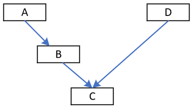 

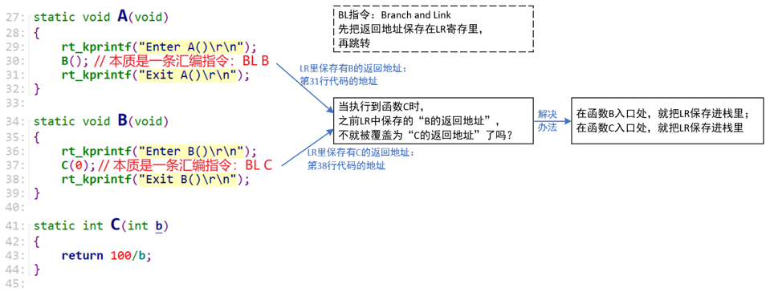 

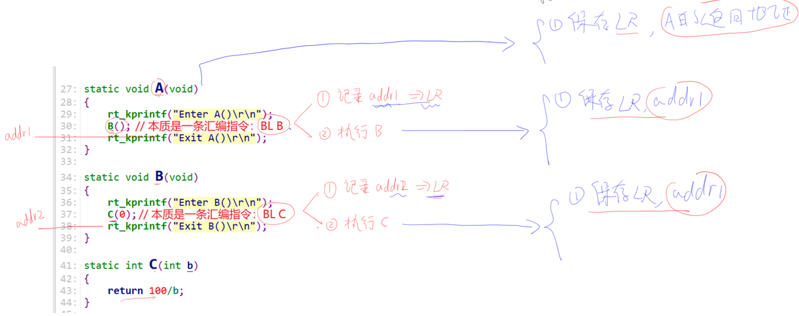 


## 1.2 函数栈

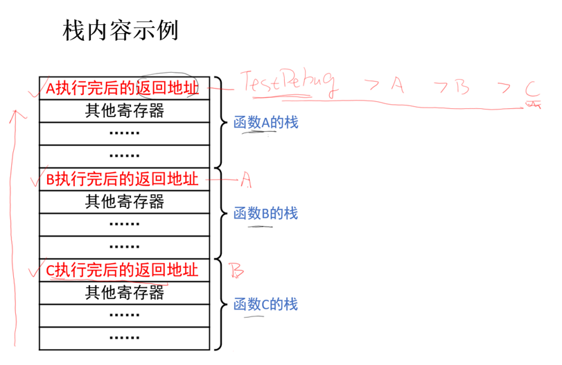 


## 1.3 异常复习

> 1. 硬件保存现场
> 2. LR = EXC_RETURN，跳转异常函数
> 3. 处理异常函数
> 4. 跳转返回地址 LR
> 5. 若 LR = EXC_RETURN，硬件恢复现场

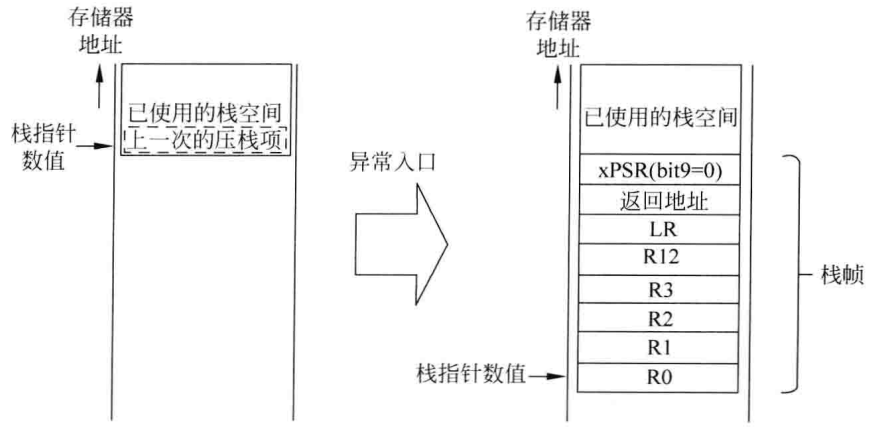 


## 1.4 异常处理

> 1. 先确定是 msp(主栈) 还是 psp(线程栈)
> 2. 将 `r4~r11`、`lr`入栈 (硬件保存的是异常中断函数的返回地址，而这个为 `EXC_RETURN`)
> 3. 将栈指针传入处理函数并跳转

```assembly
; 跳转异常处理函数前:
; 1.硬件已入栈 r0~r3,r12,lr,pc(返回地址),xPSR
; 2.lr = EXC_RETURN
; RTOS下, CPU 使用 psp 入栈; 进入异常函数后切换为 msp; 退出异常时恢复 psp
IMPORT rt_hw_hard_fault_exception
EXPORT HardFault_Handler
HardFault_Handler    PROC

; 判断 EXC_RETURN, 决定使用 msp(主堆栈指针) 还是 psp(进程堆栈指针) 寄存器
; get current context
TST     lr, #0x04          ; if(!EXC_RETURN[2])
ITE     EQ
MRSEQ   r0, msp            ; [2]=0 ==> Z=1, get fault context from handler.
MRSNE   r0, psp            ; [2]=1 ==> Z=0, get fault context from thread.
	
; 软件入栈 r4~r11,lr
; 入栈后 r0 更新位置(需更新栈指针)
STMFD   r0!, {r4 - r11}    ; push r4 - r11 register
STMFD   r0!, {lr}          ; push exec_return register
	
; 更新 msp / psp
TST     lr, #0x04          ; if(!EXC_RETURN[2])
ITE     EQ
MSREQ   msp, r0            ; [2]=0 ==> Z=1, update stack pointer to MSP.
MSRNE   psp, r0            ; [2]=1 ==> Z=0, update stack pointer to PSP.
	
; 调用 rt_hw_hard_fault_exception, r0 为第1个形参
PUSH    {lr}  ; 此时入栈不影响 r0 传入的 sp 位置
BL      rt_hw_hard_fault_exception
POP     {lr}

ORR     lr, lr, #0x04
BX      lr
ENDP
```

```c
#define rt_uint32_t unsigned int
struct exception_info
{
    rt_uint32_t exc_return;
    rt_uint32_t r4;
    rt_uint32_t r5;
    rt_uint32_t r6;
    rt_uint32_t r7;
    rt_uint32_t r8;
    rt_uint32_t r9;
    rt_uint32_t r10;
    rt_uint32_t r11;
    rt_uint32_t r0;
    rt_uint32_t r1;
    rt_uint32_t r2;
    rt_uint32_t r3;
    rt_uint32_t r12;
    rt_uint32_t lr;
    rt_uint32_t pc;
    rt_uint32_t psr;
};

void rt_hw_hard_fault_exception(struct exception_info * exception_info)
{
	unsigned int *app_sp;
	
	int i;
	
	/* exception_info + 1, 指向硬件入栈前的位置(注意指针类型) */
	app_sp = (unsigned int *)(exception_info + 1);  /* context + 16*4 */
	
	printf("psr: 0x%08x\r\n", exception_info->psr);
	printf("r00: 0x%08x\r\n", exception_info->r0);
	printf("r01: 0x%08x\r\n", exception_info->r1);
	printf("r02: 0x%08x\r\n", exception_info->r2);
	printf("r03: 0x%08x\r\n", exception_info->r3);
	printf("r04: 0x%08x\r\n", exception_info->r4);
	printf("r05: 0x%08x\r\n", exception_info->r5);
	printf("r06: 0x%08x\r\n", exception_info->r6);
	printf("r07: 0x%08x\r\n", exception_info->r7);
	printf("r08: 0x%08x\r\n", exception_info->r8);
	printf("r09: 0x%08x\r\n", exception_info->r9);
	printf("r10: 0x%08x\r\n", exception_info->r10);
	printf("r11: 0x%08x\r\n", exception_info->r11);
	printf("r12: 0x%08x\r\n", exception_info->r12);
	printf(" lr: 0x%08x\r\n", exception_info->lr);
	printf(" pc: 0x%08x\r\n", exception_info->pc);
	
	printf("stacks: \r\n");
	i = 0;
	for (i = 0; i < 1024; )
	{
		printf("%08x ", *app_sp);
		app_sp++;
		i++;
		if (i % 16 == 0)
			printf("\r\n");
			
	}
	printf("\r\n");

	while (1);
}
```

```c
static void A(void)
{
	printf("Enter A()\r\n");
	B();
	printf("Exit A()\r\n");
}
static void B(void)
{
	printf("Enter B()\r\n");
	C(0);  // 100 / 0 -> 异常
	printf("Exit B()\r\n");
}
static int C(int b)
{
	return 100/b;
}
static void D(void)
{	
	printf("Enter D()\r\n");
	C(1);
	printf("Exit D()\r\n");
}
void TestDebug(void)
{
	/* 100ask add */
	/* 使能除0错误
	 * CCR(0xE000ED14)的bit4(DIV_0_TRP)设置为1
	 */
	volatile int *CCR = (volatile int *)0xE000ED14;
	*CCR |= (1<<4);
	
	A();
	D();
}
```

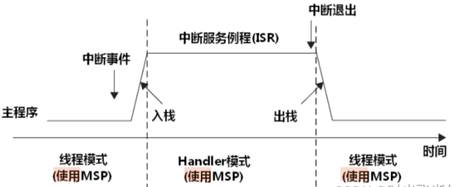 

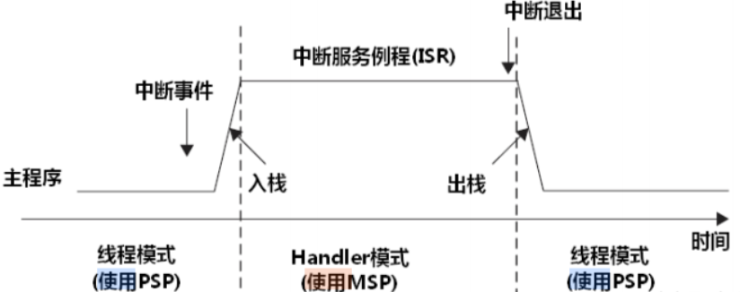

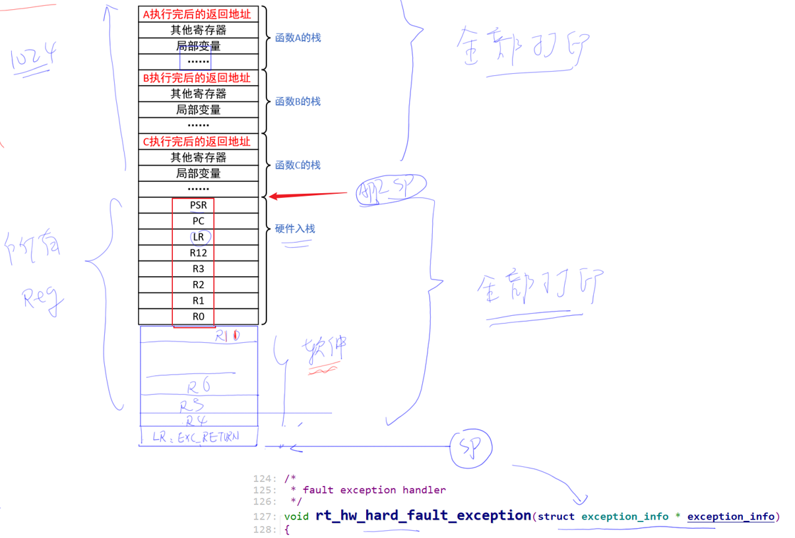 

结果：

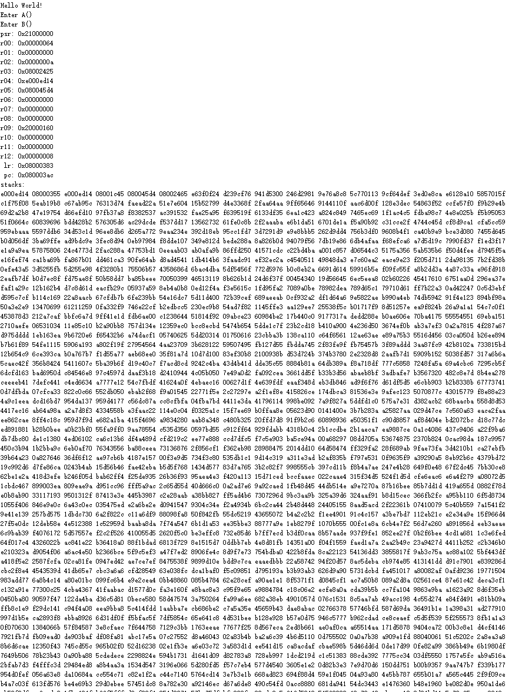


## 1.5 手动分析

> 二进制文件中的程序地址会将 `0x08000000` 映射为 `0`

1. 进异常前 `pc = 0x080003ac`，定位为异常代码在函数 C 内

   异常代码：`r0 = r0 / r1, r0 = 0x00000064 = 100, r1 = 0x00000000`

   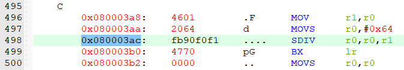

2. 进异常前 `lr = 0x08000383`，清bit0，为 `0x08000382`，即函数 C 被函数 B 调用

   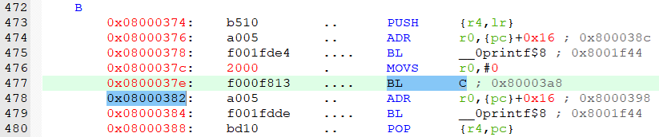 

3. 函数 B 栈内只有 r4 和 lr，即 `lr = 0x08000355`，清bit0，为 `0x08000354`

   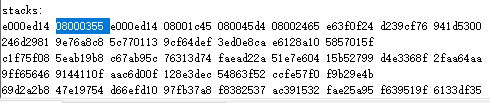 

   即函数 B 被函数 A 调用

   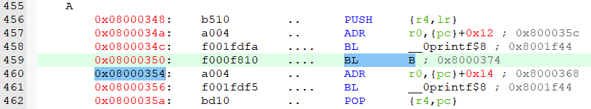

4. 函数 A 栈内只有 r4 和 lr，即 lr = `0x08001c45`，清bit0，为 `0x08001c44`

   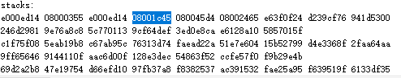 

   即函数 A 被函数 TestDebug 调用

   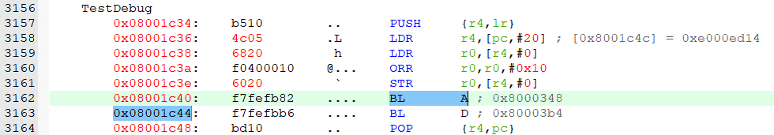 

> 以上为手动定位异常代码的函数调用关系流程


# 二. 修改bin文件实现断点

> 1. 没有调试器
> 2. 不方便使用调试器
> 3. 想查看代码任意位置的状态


